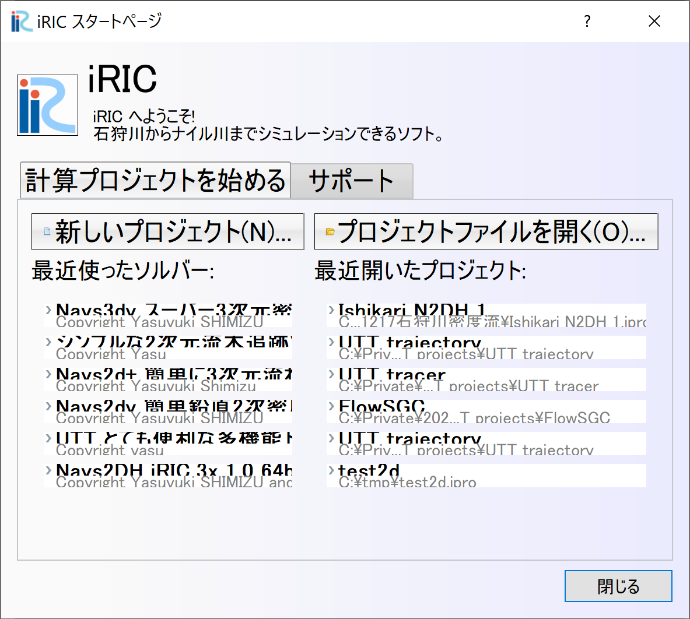
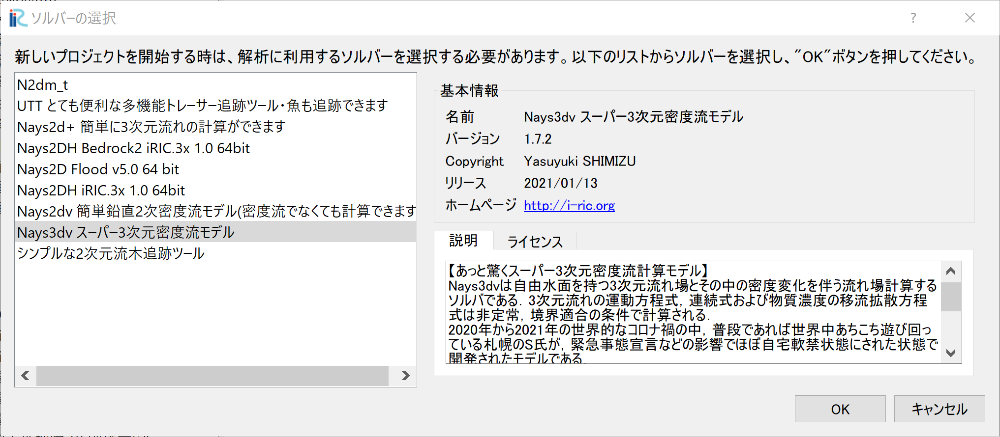
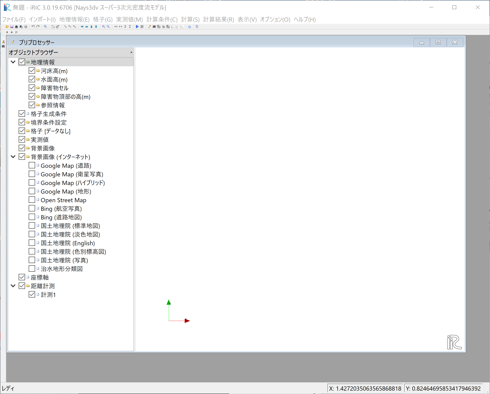
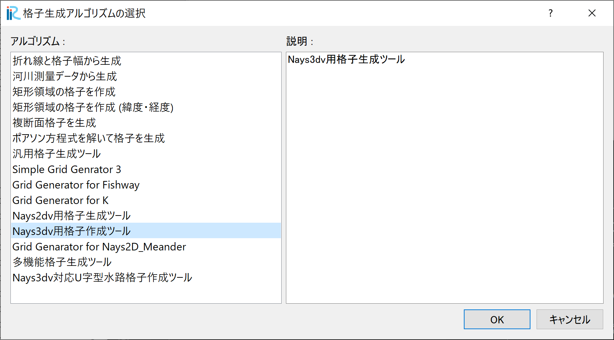
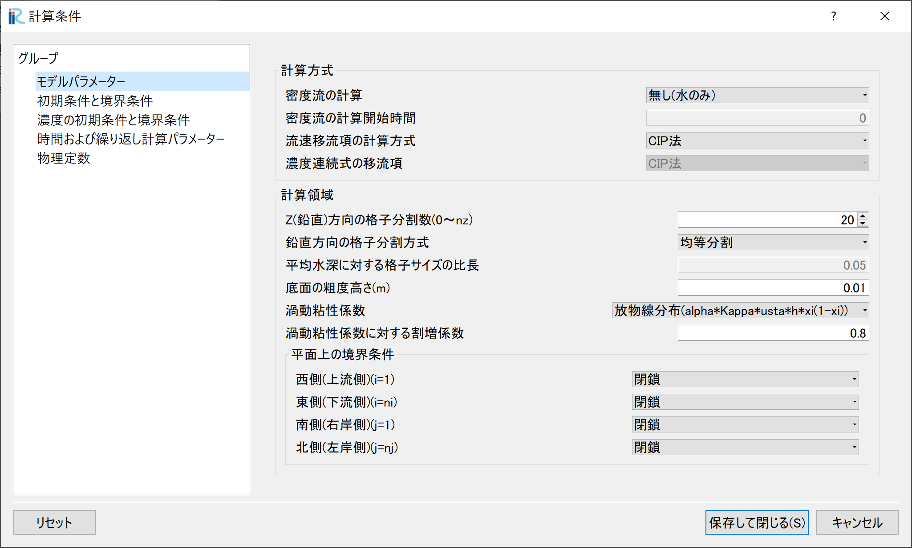
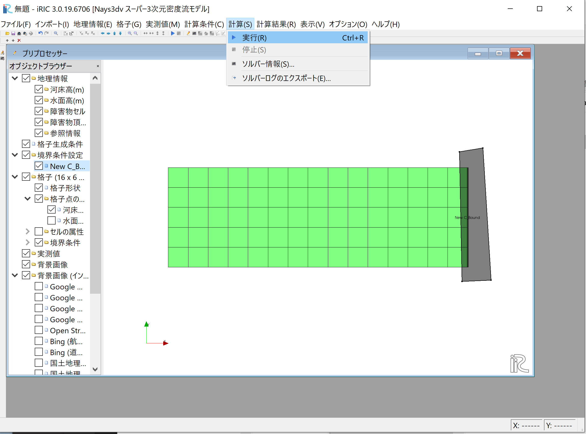
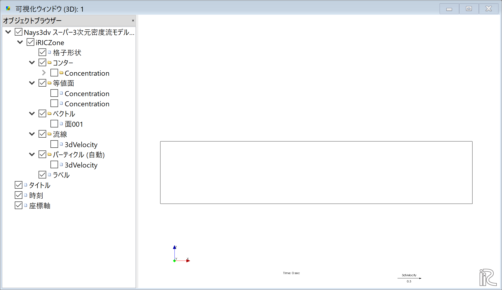

概要
============

Nays3DVにおける主な操作手順は以下のとおりである、 

Nays3DVの起動
--------------

iRIC上でのNays3DVの起動は以下の通りである。

iRICを起動し、以下の画面で[新しいプロジェクト(N)] をクリックする。

.. _image_create_new_project_1:

   : Create new project_1 

[ソルバーの選択] の画面 :numref:`image_create_new_project_2`. で 
[Nays3dv スーパー3次元密度流モデル] をクリックし[OK]をクリックする.

.. _image_create_new_project_2:

   : Create new project_2 

タイトルバーに 無題-iRIC 4.x.x.xxxxと書かれた [Nays3dv スーパー3次元密度流モデル] 画面が現れ 
:numref:`image_create_new_project_4`.

.. _image_create_new_project_4:

   : Create new project_4

Nays3dvの使用準備が完了となる。

Nays3dv用の格子の作成
-----------------------

Nays3dvで立方体、直線水路、蛇行水路、U字型水路など幾何学的な形状内の計算を
する場合はNays3dv用の格子形成ツールを使用する。

 [格子]→[格子生成アルゴリズムの選択]して現れる[格子生成アルゴリズムの選択]
 画面で[Nays3dv用格子生成ツール] を選んで[OK]をクリックする。

.. _image_Grid_creation:

   : 格子の生成

[Nyas3dv用格子生成ツール]により様々な河床、平面形状の計算空間上の格子を作成することができる。

Nays3dvの計算条件設定
--------------------------

計算条件設定はメイン画面から[計算条件]→[設定]を選ぶことにより、[計算条件]ウィンドウが現れ、これに
流れの条件や各種の初期条件・境界条件に関するパラメータを設定することにより計算条件の設定が出来る。

全てのパラメーターを設定後、[保存して閉じる]をクリックすることにより計算条件が保存される。
:numref:`image_Calculation_condition` shows the procedure.

.. _image_Calculation_condition:

   : 計算条件の設定

iRICでのNays3dvの計算実行
--------------------------

格子作成後、マッピングを行い、計算条件を設定したら、この段階でプロジェクトとして保存するか、
ipro形式でファイルを保存する。

ipro形式で保存する場合、計算格子、計算条件、計算結果はすべて１つのファイルとして保存されす。
ただし、計算結果のサイズが非常に大きい場合はプロジェクトをフォルダに保存する必要がある。
その場合はいくつかのサブフォルダが自動的に作成される。

すべての設定が終了後[計算],[実行]で計算が実行される。

.. _image_Simulation:

   : 計算の実行

iRICでNays3dvの計算結果を表示する
----------------------------------

する計算が終了したら、[計算結果]→[新しい可視化ウィンドウ(3D)を開く]をクリックすると下記の「可視化ウィンドウ(3D)]
が現れます。以下必要な設定をすることにより計算結果を可視化することが出来る。

.. _image_Viewing_results:

   : 計算結果の表示