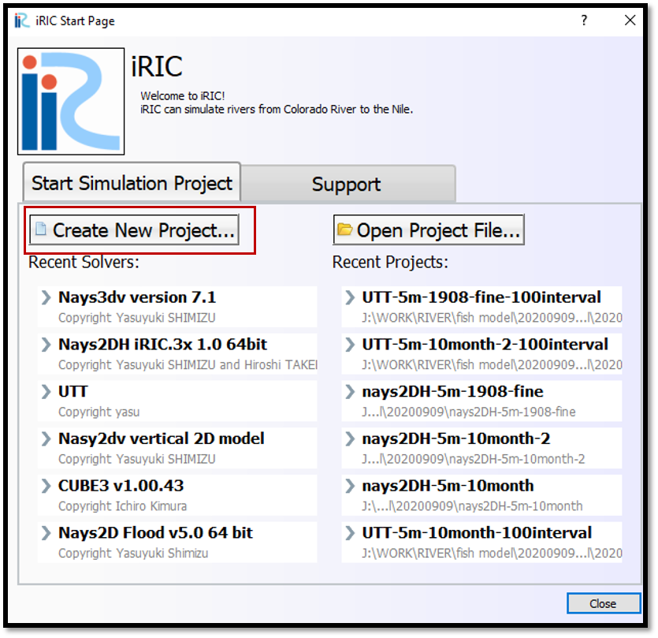

Launch Nays3DV
===================

The following is the procedure to launch Nays3DV in iRIC.

When launching iRIC, the iRIC start page can be seen as :numref:`image_create_new_project_1`.
Click on [Create New Project] in the [iRIC Start Page] window.

.. _image_create_new_project_1:

   : Create new project_1 

Then the [Select Solver] window will open as shown in :numref:`image_create_new_project_2`. Select [Nays3DV vertical 3D model] in the [Select Solver] window and click on [OK].

.. _image_create_new_project_2:

.. figure:: images/02/create_new_project_2.png
   :width: 450pt

   : Create new project_2 

A window with the title bar untitled-iRIC 3.0.19.6343 [Nays3DV vertical 3D model] will appear as shown in :numref:`image_create_new_project_4`.

.. _image_create_new_project_4:

   : Create new project_4

Nays3DV model is ready to use.

 The basic steps to follow during a simulation in Nays3DV are,
  1. Creation of the grid
  2. Mapping the attributes to the grids
  3. Setting the calculation conditions 
  4. Making a simulation
  5. Visualization of results  

