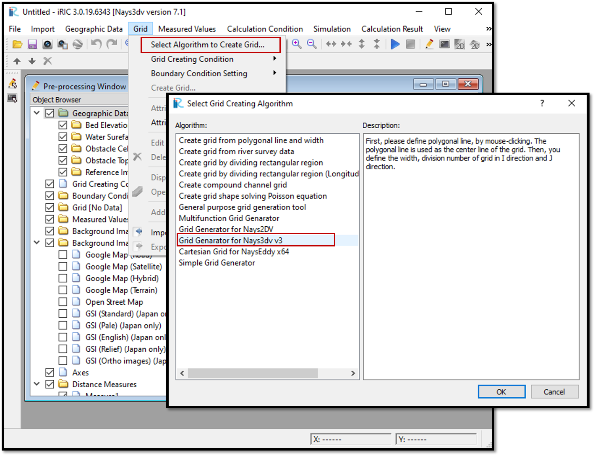

Creating grids for Nays3DV
===========================

Grid generation for Nays3DV should be done using grid generator for Nays3DV.

For that select [Grid] , then select [Algorithm to Create Grid] and
then [Grid Generator for Nays3DV] in [Select Grid Creating Algorithm] window as shown in :numref:`image_Grid_creation`. 

.. _image_Grid_creation:

   : Grid creation

Using grid generator for Nays3DV, it is possible to generate grids with flat bottom,sloped bottoms, perturbed bottom with a line or a cosine curve.
 

