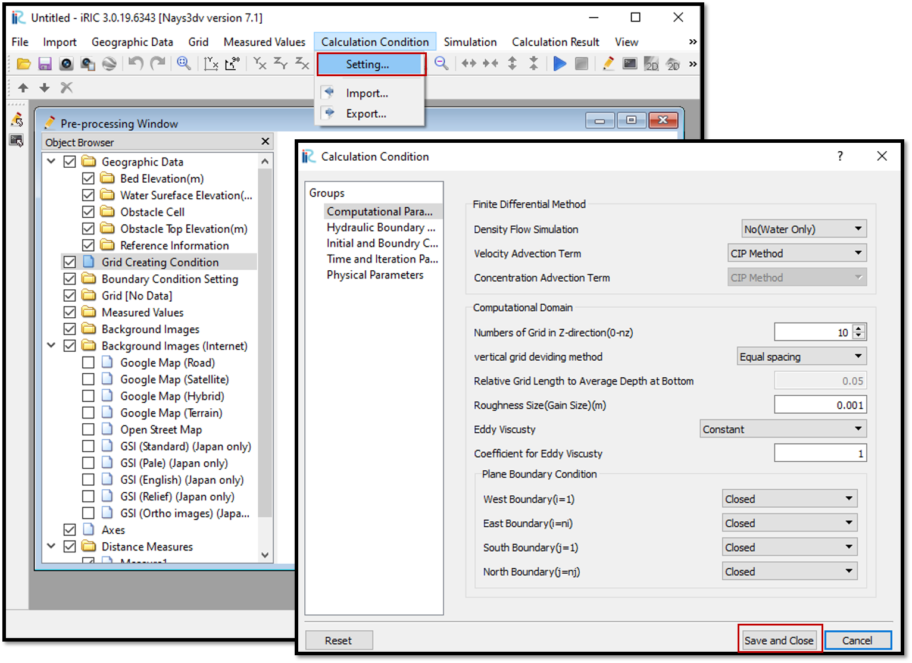

Setting the calculation conditions in Nays3DV
===============================================

In calculation conditions, computational parameters such as calculation methods either CIP or upwind, computational domain (No of grids in z direction) and their spacing, boundary condition either closed or open boundaries and hydraulic boundary conditions, initial and boundary concentrations, Time and iteration parameters and physical parameters can be set. 

After giving all the parameters, save and close.
For setting up the calculation conditions,  select [Calculation Condition] and then [Setting]. 

Then the [Calculation Condition] window will appear. :numref:`image_Calculation_condition` shows the procedure.

.. _image_Calculation_condition:

   : Calculation condition

