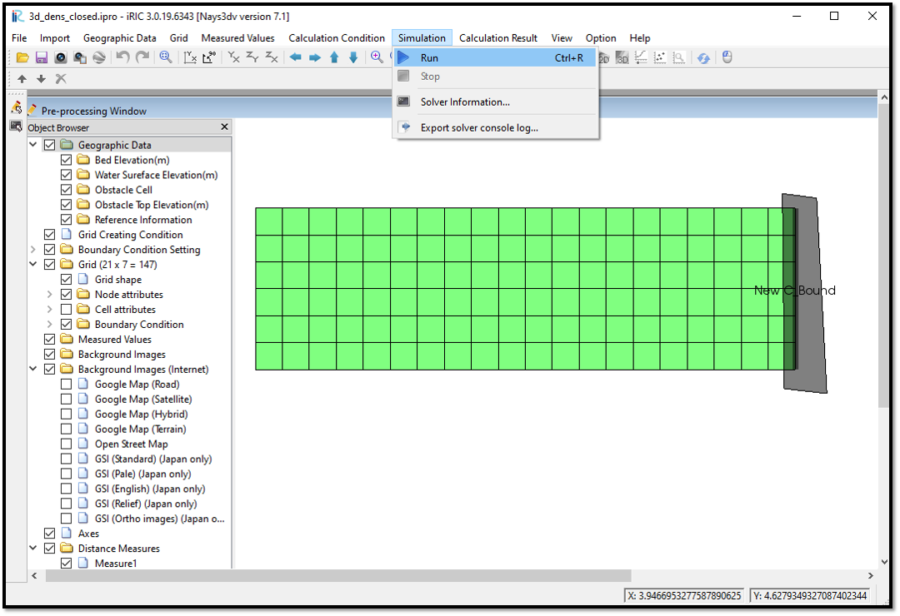

Simulation of Nays3DV in iRIC
=============================

After creating the grid, mapping all the attributes and setting the calculation conditions, save the project as a .ipro or a project.

If save as a .ipro it will be a one single file and requires less space. When the results files are huge, its not possible to save as an \*.ipro file.  
If save as a project it will be in a folder with several subfolders.

Check the node attributes and cell attributes to see whether the data are properly mapped. It is possible to edit the data there if needed.

After all the modifications save the project one last time and select [Simulation] and [Run] as shown in :numref:`image_Simulation`. Before the simulation starts, you will be asked to save again. If so click on [Save] again.

.. _image_Simulation:

   : Simulation

