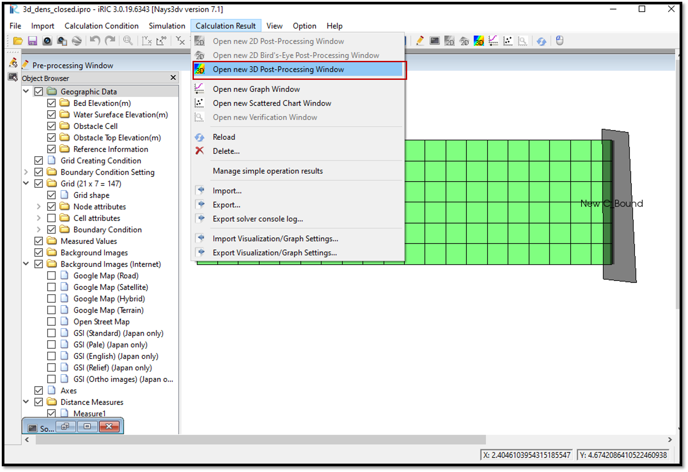

Visualization of results of Nays3DV in iRIC
============================================

After the simulation end, select [Calculation Results] and [Open new 3D Post-processing Window] or simply click on the 3D post-processing window icon. 

A window will appear as shown in the :numref:`image_Viewing_results`.

.. _image_Viewing_results:

   : Visualization of results

Tick on any parameter in the object browser and adjust properties by right clicking on it. 

It is possible to add contours, iso surfaces, arrows, stream lines and particles.
For contour setting, should go to [contour] in [object browser] and right click.
Contour setting window will appear. 
Then have to slect the physical value need to plot such as concentration, pressure, eddy viscosity, sigma, position, 3d obstacle, discharge, x-velocity, y-velocity, z-velocity or 3Dvelocity magnitude.

Then should add the faces required. For each face have to select the direction i,j,k and their ranges. 

Direction i is chosen to draw a cross sectional figure.

For arrow setting,[Object Browser], [Arrow]. Then right click on [Arrow] and [property] will appear. Arrow setting window will appear upon click on property. 

It is neccessary to add faces here which are required to plot.

For isosurface setting, select [Object Browser], [Isosurfaces] and right click, [Add]. Isosurface setting window will appear. There the physical values such as concentration, pressure, eddy viscosity, sigma, position, 3d obstacle, discharge, x-velocity, y-velocity, z-velocity or 3Dvelocity magnitude which need to be plot can be selected.

The region to be plotted and iso value and the minimum and maximum values need to be given.

The plot can be viewed 3D and rotate with right mouse click+ctrl key.

Animation of the variation can be seen with the animation icon.

