Example 01: 3D density currents in a pond
==============================================

Purpose
---------
To understand the basic operation of Nays3DV in iRIC by calculating the current field due to a density difference in a pond with an open surface.

Creation of the calculation grid and setting the initial conditions
--------------------------------------------------------------------

"Before starting the project it is safer to save the project either as ipro or as a project. Current project is saved as an ipro. Save the project by selecting, [File][save as File(\*.ipro)] as shown in ":numref:`image_01_Save_the_project`.

.. _image_01_Save_the_project:

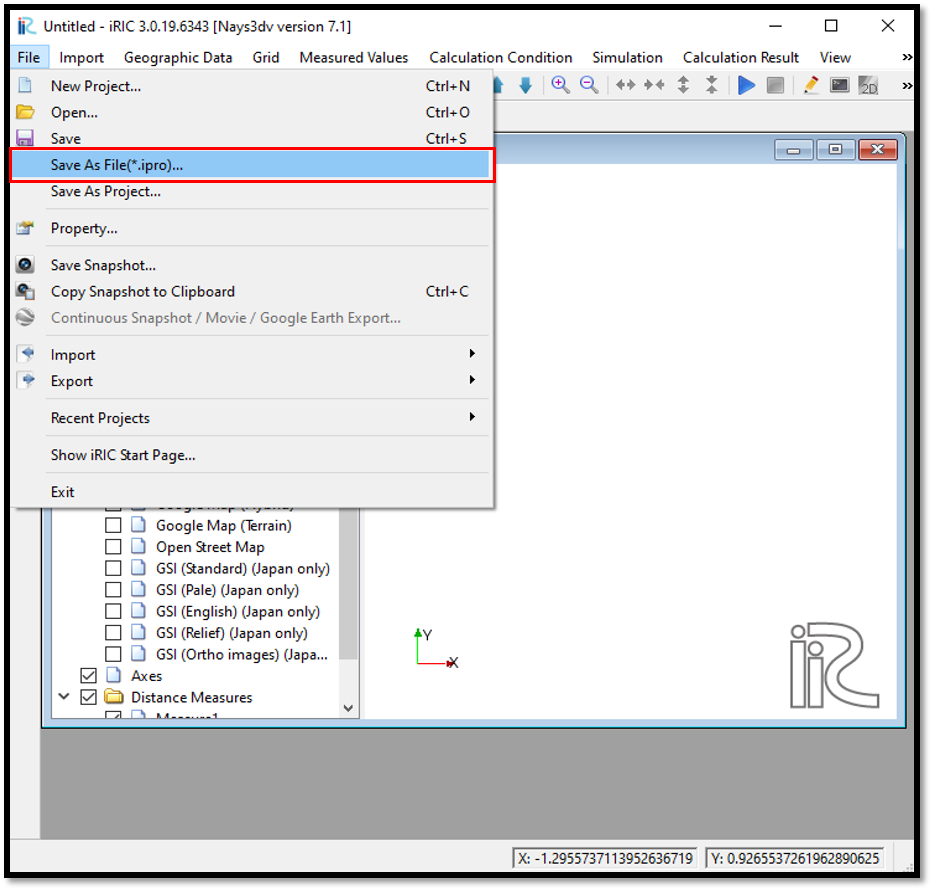

   : Save the project

The grid for the Nays3DV model can be created only by using grid generator for Nays3DV. 

Select[Grid] [Select Algorithm to Create Grid] then select [Grid Generator for Nays3DV] as shown in :numref:`image_01_Grid-creation_1`. 

.. _image_01_Grid-creation_1:

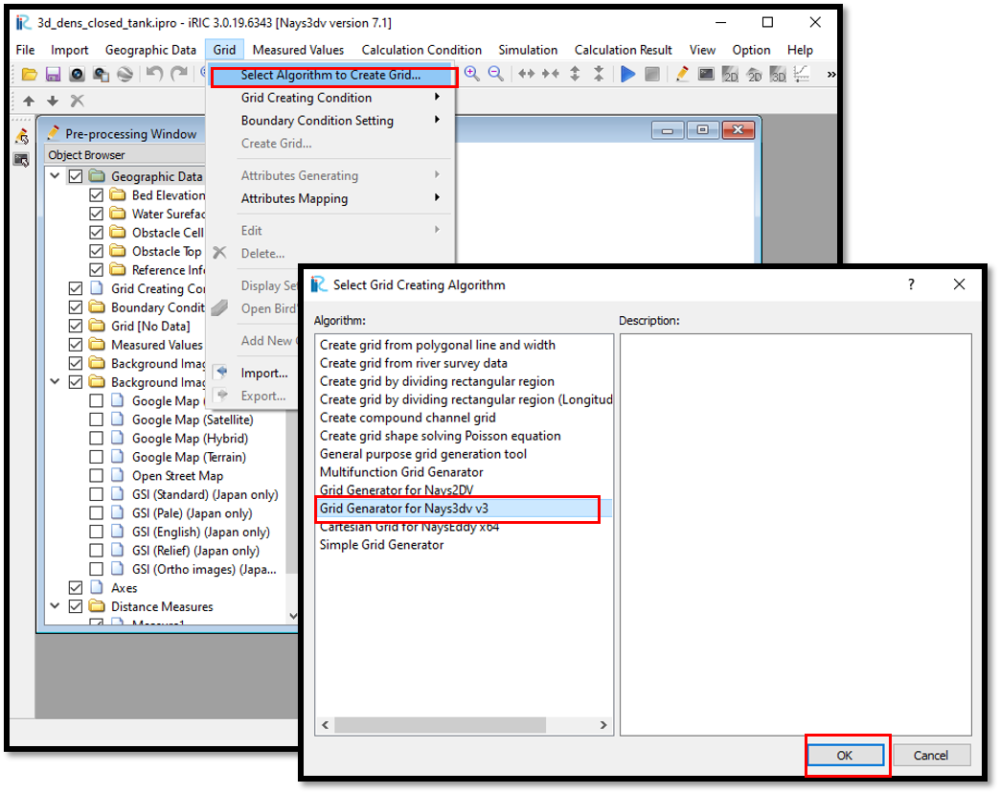

   : Grid creation

Now the grid creation dialogue will appear as shown in :numref:`image_01_Grid-creation_2`. It is possible to select the channel shape as Straight channel or cubic box, sine generated meandering channel or Kinoshita meandering channel. 
In this example select straight channel or cubic box option.

.. _image_01_Grid-creation_2:

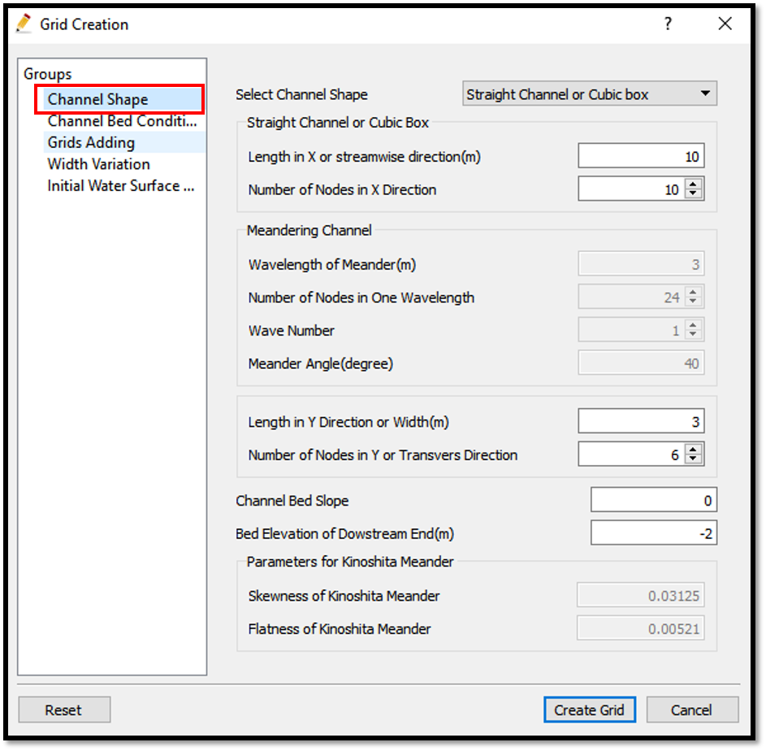

   : Grid creation

Adjust the channel length and number of grids in x and y directions as required.
However, there is a maximum limit of the number of grids.

Then we can give channel bed condition. As here we use the default condition flat(no bar), no modifications are needed.

If new grids are added or width is varied it is possible to set them. As in this example no grids added and no width variations, no modifications are needed in them.

Initial water surface profile tab is used to give downstream depth, water surface slope and initial water surface purtavation.  It can be seen as shown in :numref:`image_01_Grid-creation_3`.

.. _image_01_Grid-creation_3:

   : Grid creation

Here the water surface shape can be adjusted either as flat, linear line or a cosine curve. If they are selected as cosine shape or linear, perturvation direction needs to be adjusted either as x direction, y direction or both x and y directions.If perturvation direction is given, amplitude of the perturvation and wave number also has to be given.
In this example, water surface shape is given as cosine curve and water surface perturvation direction as x direction. Amplitude of the perturvation is 0.1 and wave number of the perturation is 1.

After giving the channel shape parameters and bed elevation and depth parameters, create grid. Then the created grid will appear as shown in :numref:`image_01_Grid-creation_4`. A confirmation message box will appear asking do you want to map geographic data to grid attributes. Simply select yes and geographic data given in reference elevation and average depth will be mapped to the grid.

.. _image_01_Grid-creation_4:

   : Grid creation

However, later if new conditions of temperature, concentration,obstacle cells etc are added, should execute the attribute mapping again.

Now, add a new concentration boundary using a polygon as shown in :numref:`image_01_Add_boundary_01`.
[Initial Concentration] [Add] [Polygon] when the plus mark appear draw the polygon as required. The cells used for the boundary need to be fully covered by the drawn polygon. 

.. _image_01_Add_boundary_01:

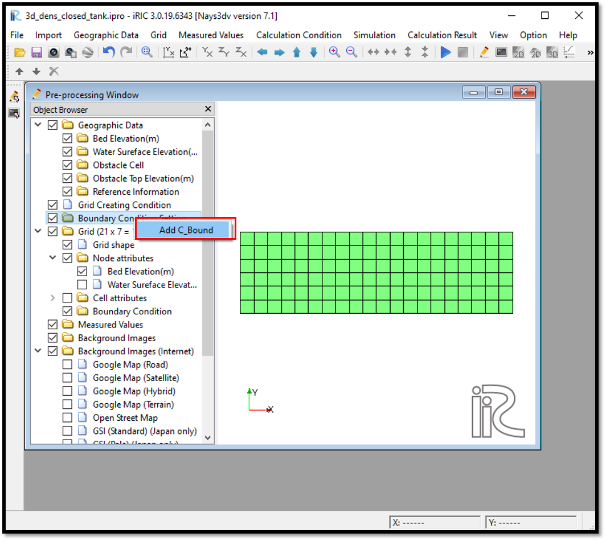

   : Adding a concentration boundary

After drawing the polygon, edit the values of the initial concentration of the drawn polygon as shown in :numref:`image_01_Add_boundary_02`.

.. _image_01_Add_boundary_02:

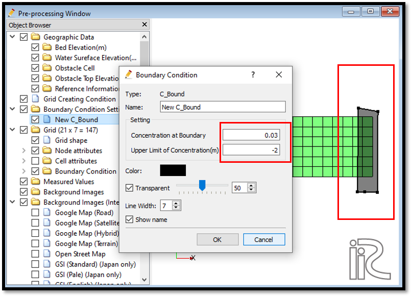

   : Assign values for the concentration boundary

In this example initial concentration is set to 0.03. The upper limit of concentration is the maximum level that the concentration boundary affect. Since in thsi example it is set as -2m and bottom level also -2m, though a density boundary is given it doesnt affect to the flow. To have an effective boundary this should be about -1 m or so.

upper limit of concentration can be defined as shown in :numref:`image_01_Concentration_boundary`.

.. _image_01_Concentration_boundary:

   : Concentration boundary 

Now the new concentration needs to be mapped to the grids using,
[Grid] [Attributes Mapping] and [Execute]. 

Then select the components needed to map. 
Select the parameters which changed the value. 
In this example it is concentration boundary. 
Therefore, concentration boundary (c_bound) is ticked as shown in :numref:`image_01_Attributes_mapping`.

.. _image_01_Attributes_mapping:

   : Attributes mapping

After successful mapping of the attributes, it can be seen from the cell attributes and node attributes. Also boundary given will appear as shown in figure with the name.

In this example check it in cell attributes.

In the [Object Browser] [Grid] [Cell Attributes] [Initial Concentration] as shown in :numref:`image_01_Attributes_mapping_check`.

.. _image_01_Attributes_mapping_check:

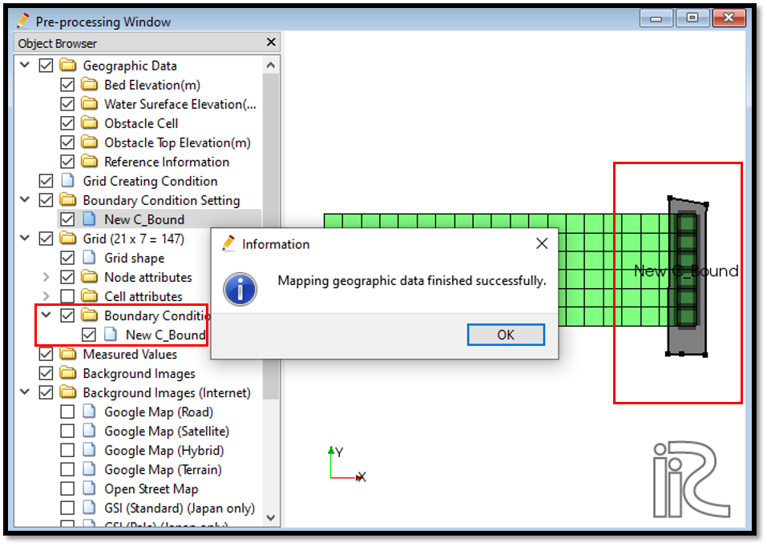

   : Attributes mapping check

As shown in the figure, concentration boundary is mapped properly. 

It is always better to check the mapping situation before the simulation. If the elevation mapping is not completed properly simulation will stop giving an error. 

Setting the calculation conditions and simulation
---------------------------------------------------
Next, calculation conditions need to be set. 

For that, select [Calculation Conditions] and [Settings].
 
Then the calculation conditions window will open as shown in :numref:`image_01_Calculation_condition_01`. Input the values as shown in figure for computational parameters. 
Here it is possible to set with density flow or without density flow. For velocity advection term and concentration advection term it is possible to use either CIP method or upwind method. In this example CIP method is used.

In the computational domain it is required to give number of grids in z direction. According to this the Z direction grids in the domain will be created. 

.. _image_01_Calculation_condition_01:

   : Setting Calculation conditions

In this example, all the four boundaries are closed boundary as this is a closed tank. 

As all the four boundaries are closed boundaries, hydraulic boundary conditions and initial and boundary concentration settings are inactive as shown in figures below. However, as a concentration boundary is given, should click yes for density boundary condition.
 
.. _image_01_Setting_Calculation_condition_02:

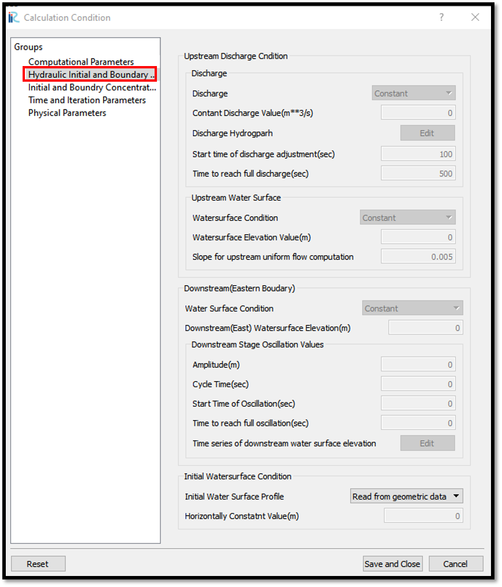

   : Setting Calculation conditions-Hydraulic boundary condition

.. _image_01_Calculation_condition_03:

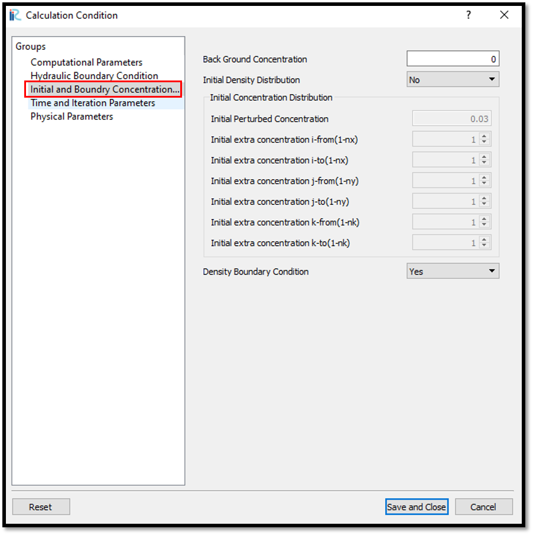

   : Setting Calculation conditions-initial and boundary concentrations

Then input parameters for time and iteration parameters as shown in :numref:`image_01_Calculation_condition_04`. 

.. _image_01_Calculation_condition_04:

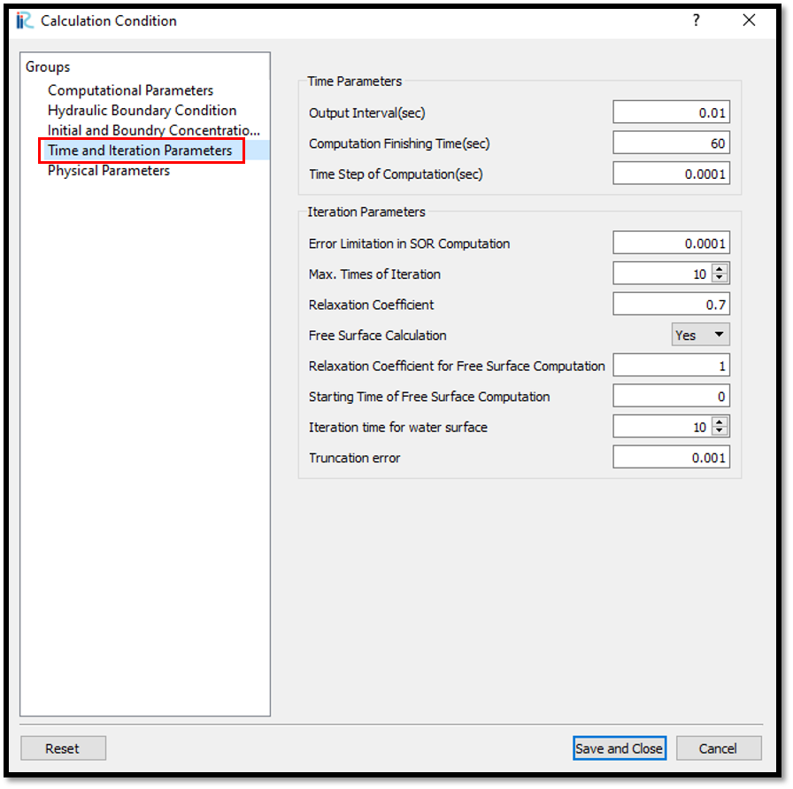

   : Setting Calculation conditions-Time and iteration parameters 

Time and iteration parameters are important for simulation stability. 

Computational time step needs to be set considering the CFL condition according to the grid size.

If the computation fails at the initial stage, change the time step to a smaller value and try again.

Then adjust the physical parameters as shown in  :numref:`image_01_Calculation_condition_05`.

.. _image_01_Calculation_condition_05:

   : Setting Calculation conditions-Physical parameters 
 
Physical parameters need to be adjusted according to the fluids used. 
In this example default values are used.

After setting all the calculation parameters, save and close the window. 

Then run the simulation with [Simulation]  [Run] as shown in  :numref:`image_01_Simulation_01`.

.. _image_01_Simulation_01:

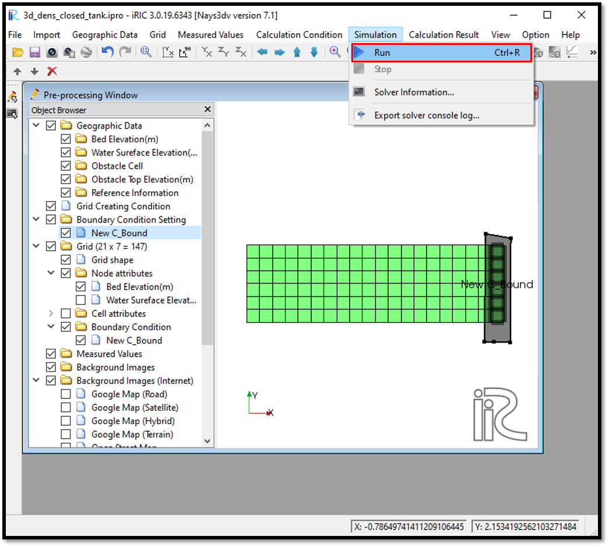

   : Simulation

A message will come recommending to save the project as shown in :numref:`image_01_Save`. Click yes and save the project again and simulate.

.. _image_01_Save:

.. figure:: images/01/01_Save.png
   :width: 450pt

   : Save

The simulation will run as shown in :numref:`image_01_Simulation_02`.

.. _image_01_Simulation_02:

.. figure:: images/01/01_Simulation_02.png
   :width: 450pt

   : Simulation in progress

Visualization of results
-------------------------

After the computation is stopped, results can be viewed from [Calculation Results] [Open new 3D Post-Processing Window] as shown in :numref:`image_01_Viewing_results_01` or by clicking on 3D post-processing window icon.

.. _image_01_Viewing_results_01:

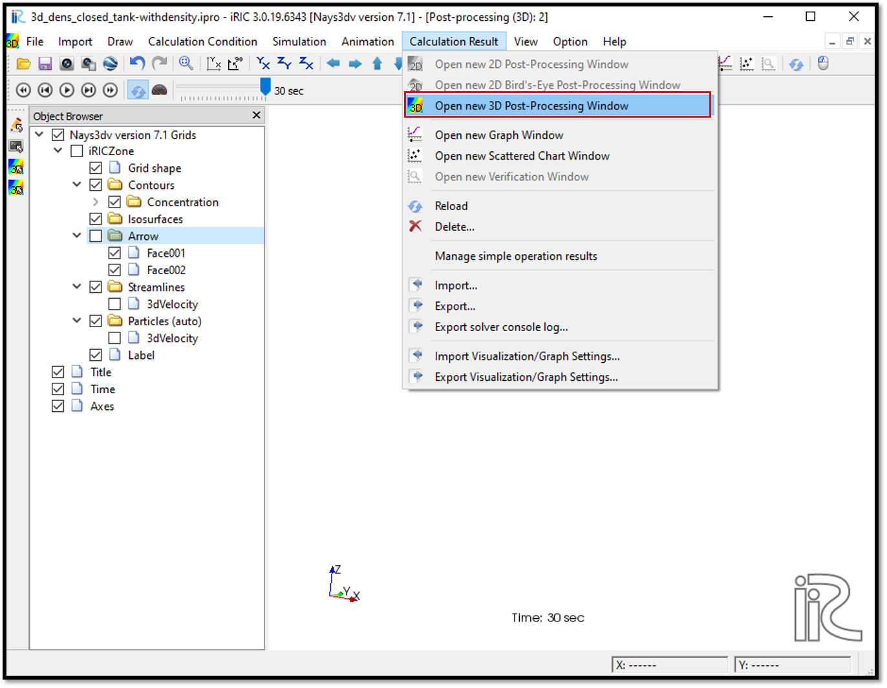

   : Viewing results
 
The 3D post processing window will appear as shown in :numref:`image_01_Viewing_results_02`

.. _image_01_Viewing_results_02:

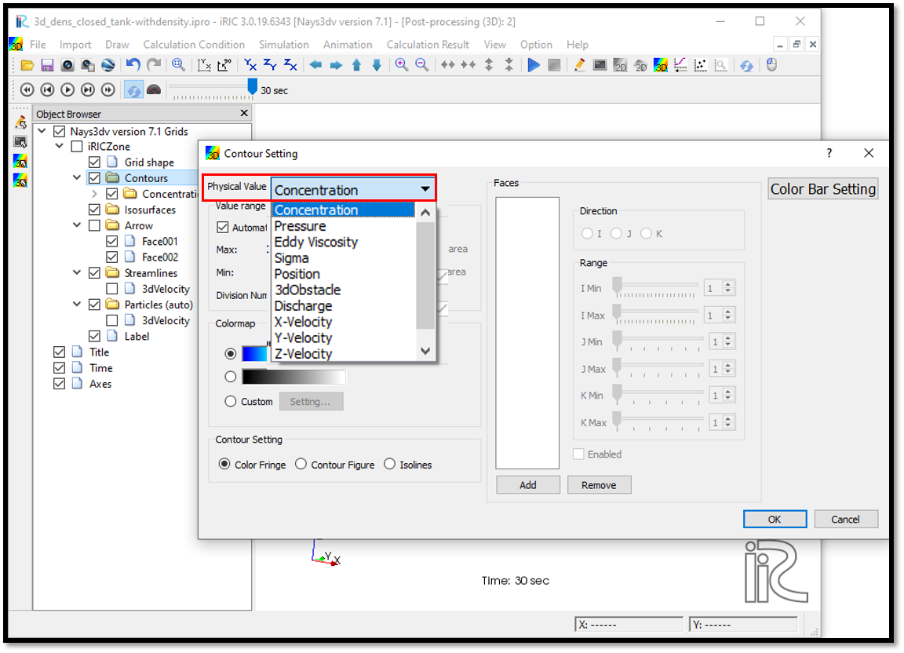

   : Viewing results

In post processing window, the parameters need to be viewed can be selected in object browser. 
They can be selected either as contours, isosurfaces, arrows, streamlines or particles.

To see concentration contours, go to [contours] in [object browser] and right click there. Then we can add and a contour setting dialoge box will appear.

As shown in :numref:`image_01_Viewing_results_02` it is spossible to add contours of either concentration, pressure, eddy viscosity, sigma, position, 3d obstacle,discharge, x-velocity, y-velocity, z-velocity or 3Dvelocity magnitude.

As shown in the :numref:`image_01_Viewing_results_03`, it is possible to add faces which need to be viewed and should adjust the i, j, k ranges of them. Can add multiple faces too. Value ranges, colour ranges as our selected cases can be adjusted.

.. _image_01_Viewing_results_03:

   : Viewing results- Contour setting

In this example two faces are added to visualize 3D velocity magnitude.

The same way arrow setting also can be done by right clicking [Arrow] in [Object Browser] and [Property] . Then arrow setting window will appear as shown in :numref:`image_01_Viewing_results_04` 

.. _image_01_Viewing_results_04:

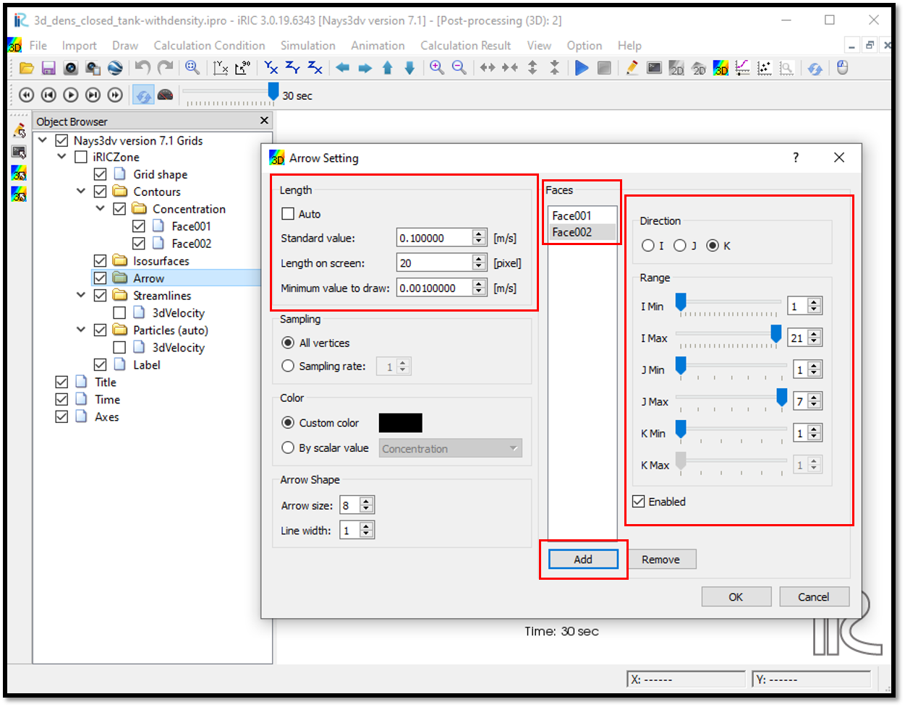

   : Viewing results - Arrow setting

Plot can be viewed in 3D and move as our preferrred direction with right mouse click+ctrl key.

The :numref:`image_01_Viewing_results_05` is a representation of 3D velocity magnitude in two faces with arrows.
 
.. _image_01_Viewing_results_05:

   : Viewing results - 3D velocity representation

The animation of the movement can be viewed with animation buttons in top of the3D post-processing window.
