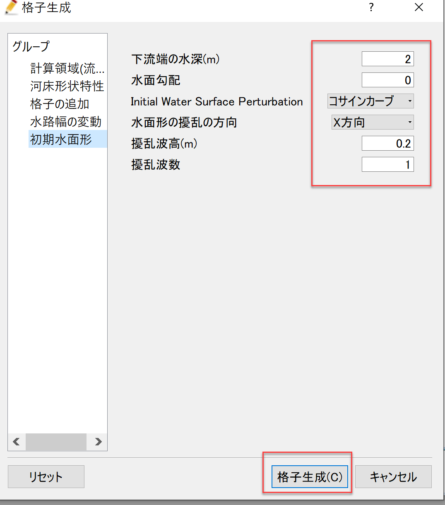
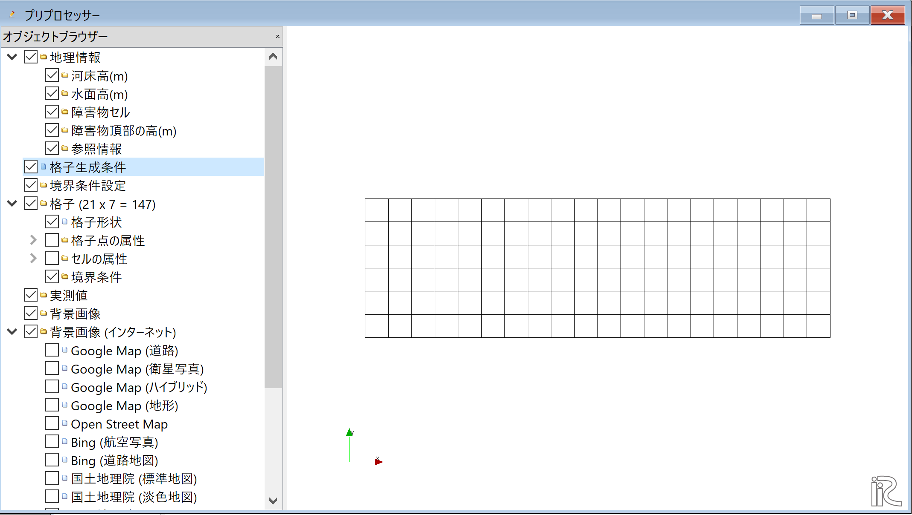
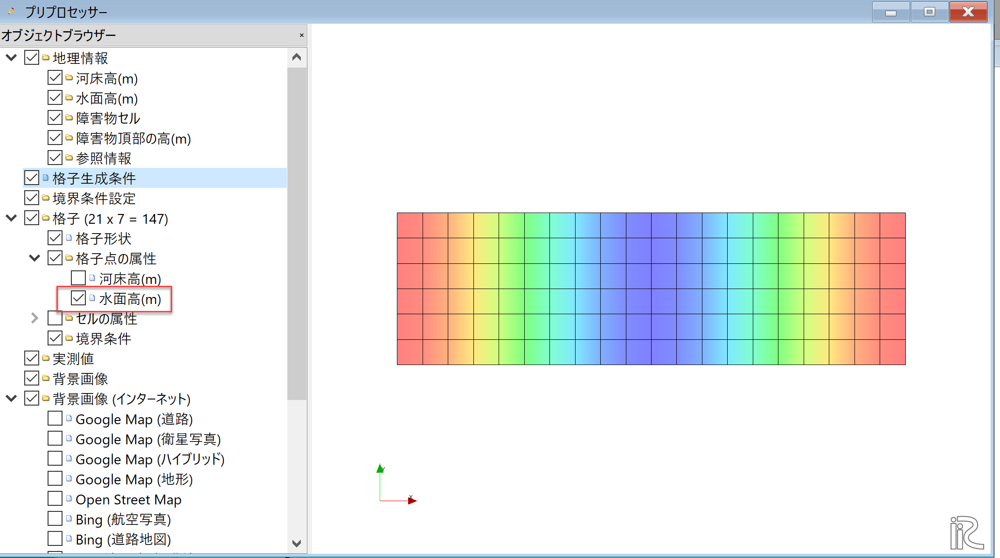
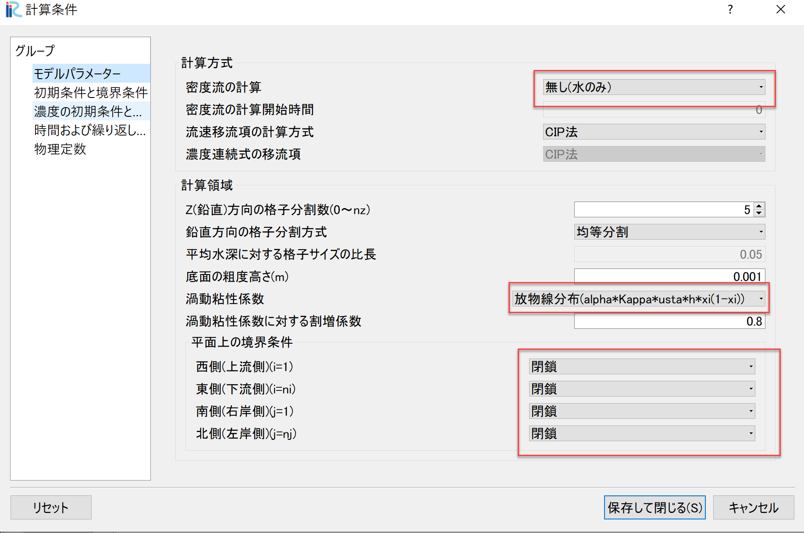
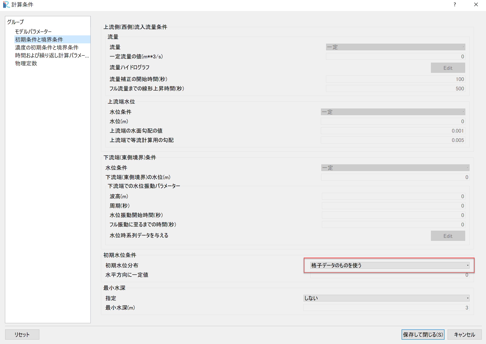
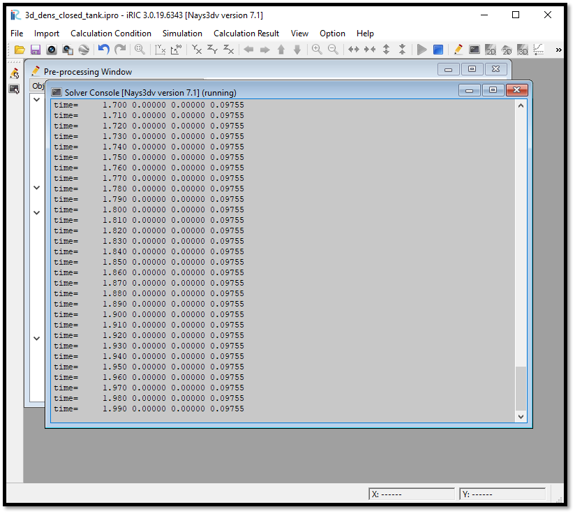
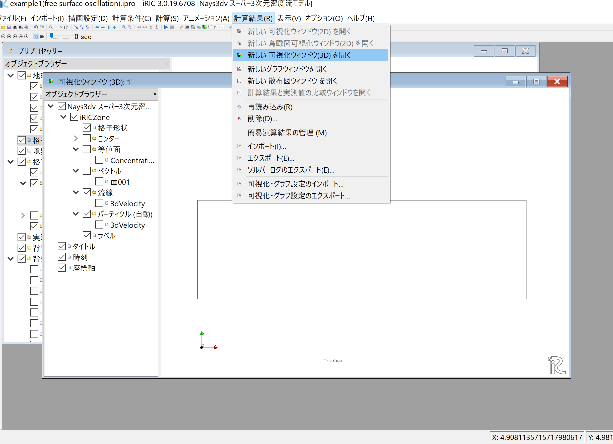

[計算例 1]長方形水槽における自由水面の振動
==============================================

Nays3dvを使って閉鎖水域(長方形の水槽)の自由水面の挙動のシミュレーションを行う。
ここでは、長方形形状の水槽の水面にコサインカーブの初期擾乱を与えて、その振動の様子を
観察する。

---------------
ソルバの選択
---------------

iRICの起動画面から、[新しいプロジェクト]を選ぶと表示されるソルバの選択画面で、
[Nays3dvスーパー3次元密度流モデル]を選んで[OK]ボタン押すと、

   : ソルバーの選択

「無題- iRIC 4.x.x.xxxx [Nays3dvスーパー3次元密度流モデル]」と書かれた
Windowが現れる。

.. _01_mudai:

   : 無題

計算格子の作成はNays3dv専用の格子生成ツールを用いる。:numref:`01_mudai` 
のウィンドウで、[格子]→[格子生成アルゴリズムの選択]から現れる、
「格子生成アルゴリズムの選択」ウィンドウ で[Nays3dv用格子生成ツール]を選んで[OK]を押す。

   : 格子生成アルゴリズムの選択

--------------
計算格子の作成
--------------

.. _02_koushi_1:

   :格子生成(計算領域)形状

:numref:`02_koushi_1` の画面で、「X軸方向(流下方向)の長さ(m)」を[10], 「X軸方向のセル数」を[20],
「Y方向長さもしくは流路長(m)」を[3], 「Y方向または横断方向のセル数」を[6], 
「主流路部の勾配」を[0], 下流端の河床高(m)を[-2]とする。入力が終わったら「初期水面形」のグループへ
移動する。

.. _03_koushi_2:

   :格子生成(計算領域)形状

:numref:`03_koushi_2` の画面で、「下流端の水深(m)」を[2], 「水面勾配」を[0],
「初期水面擾乱(Initial Water Surface Perturbation)」を[コサインカーブ], 
「水面擾乱の方向」を[X方向], 
「擾乱波高(m)」を[0.2], 擾乱波数を[1]とすして、最後に[格子生成]ボタンを押す。

.. _04_koushi_3:

.. figure:: images/01/koushi_3.png
   :width: 50%

   :確認(マッピング)

すると、:numref:`04_koushi_3` 確認ウィンドウが現れるので,[はい(Y)]を押すと格子が生成され、
下図 :numref:`05_koushi_4` が表示される。

.. _05_koushi_4:

   :格子生成完了

ここで確認のためににオブジェクトブラウザーで「格子」「格子点の属性」「水面高」にチックマークを付けて
表示させると :numref:`06_koushi_5` のように水面形がコサインカーブの形状をしているのが分かる。

.. _06_koushi_5:

   :格子生成完了

--------------
計算条件の設定
--------------

次に計算条件の設定を行う。メニューバーから「計算条件」→「設定」を選ぶと、
計算条件設定ウィンドウ :numref:`07_jouken_1` が表示される。

.. _07_jouken_1:

   :モデルパラメータ

:numref:`07_jouken_1` のように条件を入力する。
密度流の計算ではないので「密度流の計算」は[無し(水のみ)], 「渦動粘性係数」は[一定]でも良いが、
ここでは対数流速分布に対応する[放物線分布] :math:`\nu_t=\alpha \kappa u_\ast h \xi (1-\xi)`
を選択する。また、閉鎖水域なので４方向全てを[閉鎖]にしておく。

.. _08_jouken_2:

   :初期条件と境界条件

次に、「初期条件と境界条件」 :numref:`08_jouken_2` では、初期水位は格子生成で作成したコサインカーブを使用するので、
[格子データのものを使う]を選ぶ。

.. _09_jouken_3:

   :時間および繰り返し計算パラメーター

「時間および繰り返し計算パラメーター」 :numref:`09_jouken_3` 図に示したようなパラメータを設定する。なお、
自由水面振動の計算なので、「自由水面の計算」は必ず[する]にしておく必要がある。

設定が終わったら[保存して閉じる]を押す。

------------
計算の実行
------------

.. _10_keisan:

   :計算実行中の画面

[計算]→[実行]を指定すると、:numref:`10_keisan` のような画面が現れ計算が始まる。

-------------------------
計算結果の表示
-------------------------

計算の終了後、[計算結果]→[新しい可視化ウィンドウ(3D)を開く]を選ぶことによって、可視化ウィンドウが現れる。

.. _11_kekka_0:

   : 計算結果の表示(1)
 

「Ctrl」ボタンとマウス右ボタンを押しながらマウスを上下左右に動かすことによって、
3次元的な見え方が、また、マウスぼセンターダイヤを回すことにより、 :numref:`12_kekka_1` のような
拡大・縮小が可能となっている。

.. _12_kekka_1:

   : 3D格子の移動・拡大・縮小
 

^^^^^^^^^^^^^^^
ベクトルの表示
^^^^^^^^^^^^^^^

オブジェクトブラウザーで、[ベクトル]を右クリックして、[追加]をクリックすると現れるウィンドウで[3dVelocity]を選択すると、
「ベクトル設定」ウィンドウ :numref:`13_kekka_2` が現れる。

.. _13_kekka_2:

   : ベクトルの設定
 
:numref:`13_kekka_2` を参考に設定をして、[OK]をクリック。 [アニメーション]→[開始/停止]ボタンで、
:numref:`14_kekka_3` のアニメーションが表示される。 [開始/停止]は :numref:`14_kekka_3` 
の赤丸のプレイボタンでも可能である。

.. _14_kekka_3:

   : ベクトルのアニメーション
 

^^^^^^^^^^^^
圧力の表示
^^^^^^^^^^^^

オブジェクトブラウザーで、[コンター]を右クリックして、[追加]をクリックすると、
「コンター設定」ウィンドウが現れる。ここで、 :numref:`15_kekka_4` の設定をして[OK]を
押すとコンターが表示される。

.. _15_kekka_4:

.. figure:: images/01/kekka_4.gif
   :width: 100%

   : コンター設定

以下、ベクトルと同様にアニメーション表示も出来る。
