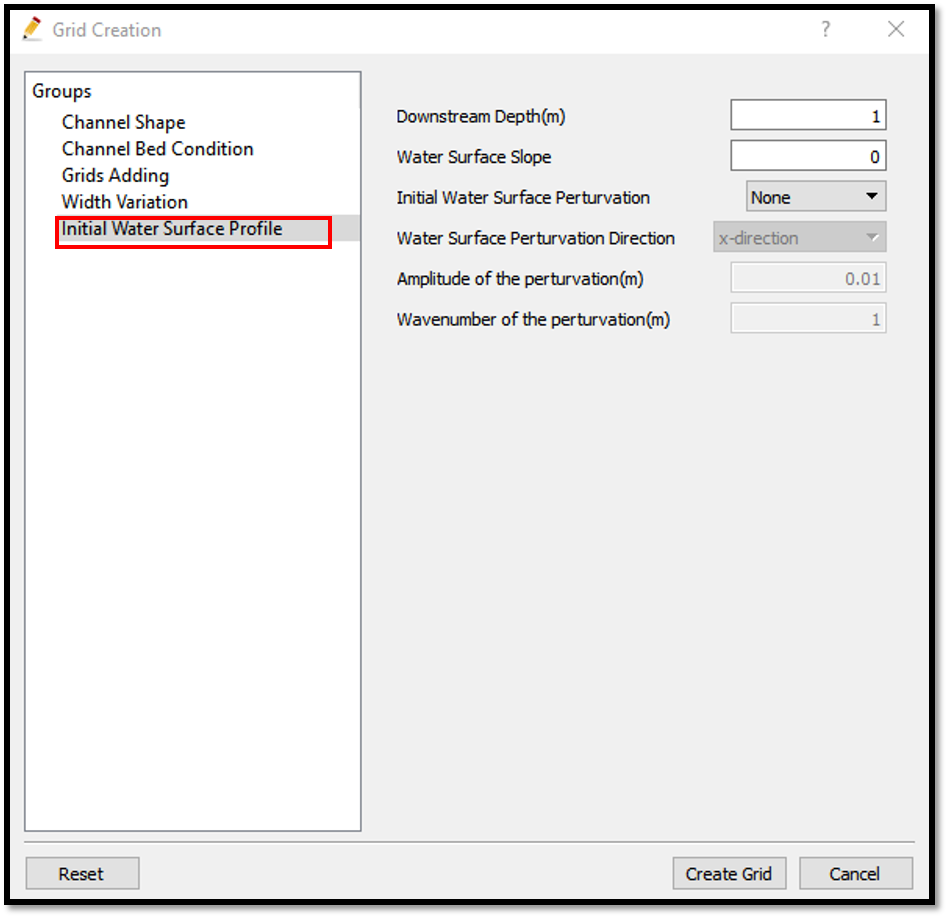
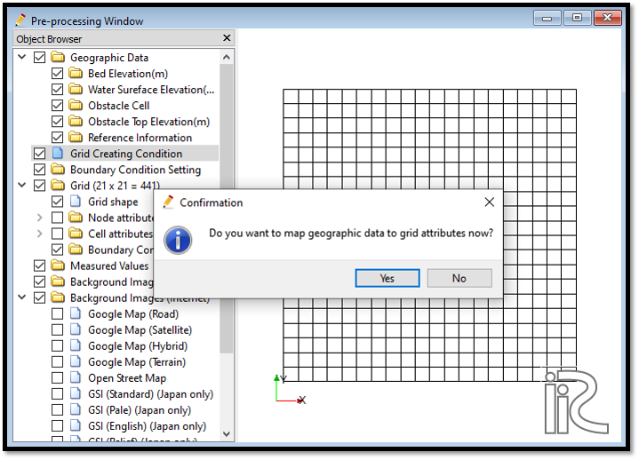
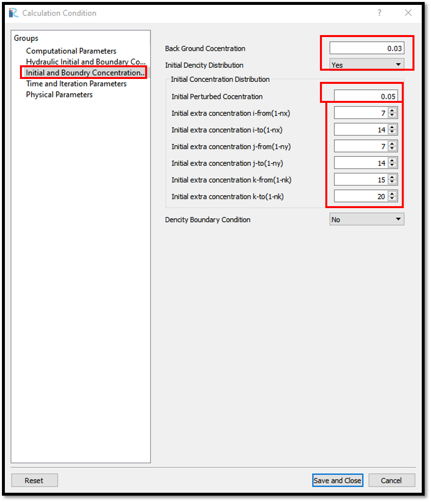
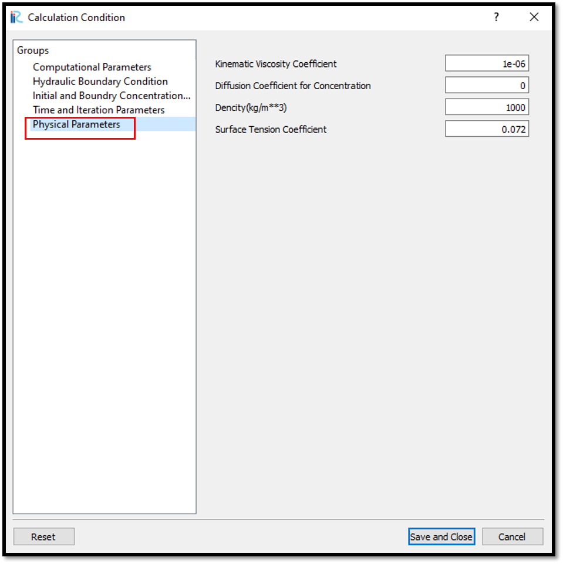
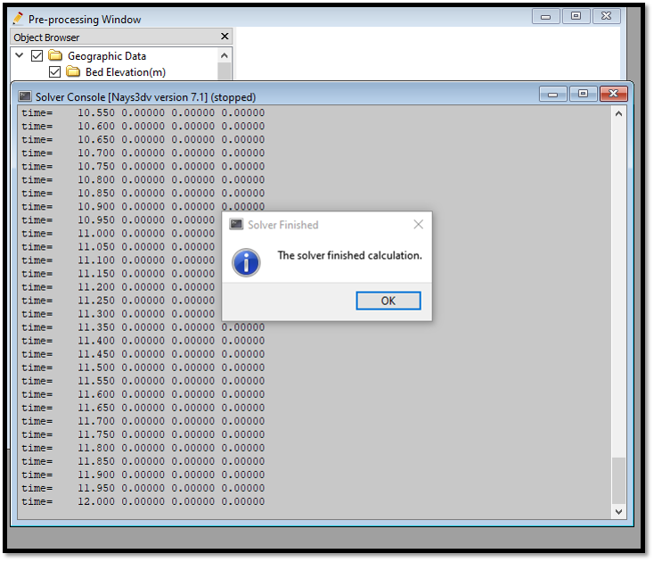

Example 03: Dropping object inside a tank 
============================================================================

Purpose
---------
To calculate the gravity driven flow when a density difference occurred in vertical direction such as falling a heavy liquid from the top.

Creation of the calculation grid and setting the initial conditions
------------------------------------------------------------------------
As explained in the other examples and the introduction, create the grid using, [Grid], [Select Algorithm to Create Grid] and then select [Grid Generator for Nays3DV].
Then the grid creation window will appear.

In grid creation window, give channel shape parameters as shown in :numref:`image_03_Grid_Creation_01`.

.. _image_03_Grid_Creation_01:

   : Grid creation : Chanel Shape

Then we can give Chanel bed condition. As here we use the default condition flat(no bar), no modifications are needed.

If new grids are added or width is varied it is possible to set them. As in this example no grids added and no width variations, no modifications are needed in them.

Initial water surface profile tab is used to give downstream depth, water surface slope and initial water surface purtavation.  It can be seen as shown in :numref:`image_03_Grid_Creation_02`. After giving all the parameters click on [Create Grid].

.. _image_03_Grid_Creation_02:

   : Grid creation : Bed elevation and Depth

Then the grid is created and a confirmation message box will appear asking to map the geographic data as shown in :numref:`image_03_Grid_Creation_03`. and click on [Yes].

.. _image_03_Grid_Creation_03:

   : Grid creation : Mapping geographic data to the grid

This will map the geographic data to the grid and the mapped grid can be seen as shown in :numref:`image_03_Grid_Creation_04`. 

.. _image_03_Grid_Creation_04:

   : Grid creation : Mapping geographic data to the grid

Save the project with [File], [Save as .ipro] or [Save as Project] as in :numref:`image_03_Save_02`. 

.. _image_03_Save_02:

   : Save as ipro

Setting the calculation conditions and simulation
---------------------------------------------------
Set the calculation conditions with, [Calculation Condition], [Setting].

Calculation condition window will open.

Set computational parameters as shown in :numref:`image_03_Calculation_condition_01`.

.. _image_03_Calculation_condition_01:

.. figure:: images/03/03_Calculation_condition_01.png
   :width: 100%

   : Calculation Condition : Computational Parameters

Then give hydraulic boundary conditions. Since the boundary conditions are closed boundaries , boundary condition window is inactive as shown in :numref:`image_03_Calculation_condition_02`.

.. _image_03_Calculation_condition_02:

   : Calculation Condition : Boundary Conditions

Then give initial and Boundary concentrations as shown in :numref:`image_03_Calculation_condition_03`. 

.. _image_03_Calculation_condition_03:

   : Calculation Condition : Initial and Boundary Concentrations

Here background concentration is the concentration inside tank and perturbed concentration is concentration of the dropping item. To drop and go down the tank, the purturbed concentration should be higher than the background concentration.

The i, j, k start and end locations of the purturbed concentration should be given as shown in above figure.
 
Then the time and iteration parameters are give as shown in :numref:`image_03_Calculation_condition_04`. 

.. _image_03_Calculation_condition_04:

   : Calculation Condition : Time and Iteration parameters

Then give the physical parameters as given in :numref:`image_03_Calculation_condition_05`. 

.. _image_03_Calculation_condition_05:

   : Calculation Condition : Physical Parameters

After setting the calculation conditions, save and close the calculation condition window. 

Save the project again. Now start the simulation by [Simulation], [Run].

The end of simulation can be seen as shown in :numref:`image_03_End_of_simulation`. 

.. _image_03_End_of_simulation:

   : End of simulation

Visualization of results
-------------------------
After calculation solver stopped, go to [Calculation Results], [Open new 3D Post-Processing Window].

Here it is easy to visualize as isosurfaces.
Go to [Object Browser] - [iRIC Zone] - [Isosurfaces] and right click on [Isosurfaces]. Isosurface setting window will appear as shown in :numref:`image_03_Visualization_of_results_01`. 

.. _image_03_Visualization_of_results_01:

   : Visualization of results : Isosurface setting

Iso value need to be set and the min and max value can be used as a guide to set Iso value.

Colour also need to be set to be seen nicely. Default colour is white and if the colour setting is forgetted, isosurface can't be seen.

The movement of concentration can be seen as shwon in :numref:`image_03_Visualization_of_results_02`. 

.. _image_03_Visualization_of_results_02:

   : Visualization of results : Isosurface of concentration

If need to visualize the concentration as countours, goto [Object Browser] - [iRICZone] - [Contours]. Right click on contours and [Add]. Contour Setting window will appear as shown in :numref:`image_03_Visualization_of_results_03`. 

.. _image_03_Visualization_of_results_03:

   : Visualization of results : Contours Setting

Contours of concentration at the start and end can be seen as shown in :numref:`image_03_Visualization_of_results_04`. 

.. _image_03_Visualization_of_results_04:

.. figure:: images/03/03_Visualization_of_results_04.gif
   :width: 100%

   : Visualization of results : Contours of concentration

 

