[計算例 3] 密度の軽い流体による上昇流
============================================================================

立方体の下部中央に周囲より密度の小さな流体が置かれた状態を初期条件として
その後の流体および密度変化の挙動をシミュレーションする。

--------------
計算格子の生成
--------------

計算格子の作成はNays3dv専用の格子生成ツールを用いる。 :numref:`03_03_koshi_1` 
で[Nays3dv用格子生成ツール]を選択し。[OK]をクリックする。

.. _03_03_koshi_1:

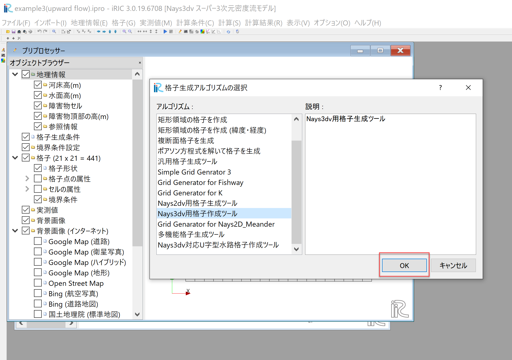

   : 格子生成アルゴリズムの選択

下図の :numref:`03_03_koshi_2` で赤囲いの部分を設定する。 

.. _03_03_koshi_2:

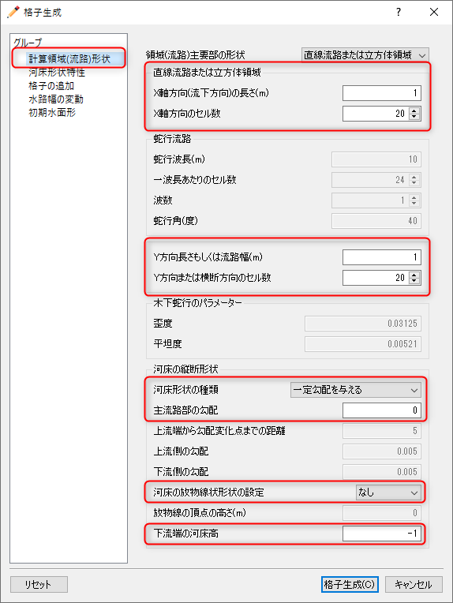

   : 格子生成: 計算領域

下図 :numref:`03_03_koshi_3` で赤囲いの部分を設定し、格子生成をクリックすると、
:numref:`03_03_koshi_4` が現れ、「マッピングしますか？」と聞かれるので、
[はい(Y)]を選択すると、格子生成が完了する。

.. _03_03_koshi_3:

.. figure:: images/03/koshi_3.png
   :width: 250pt

   : 格子生成： 初期水面形

.. _03_03_koshi_4:

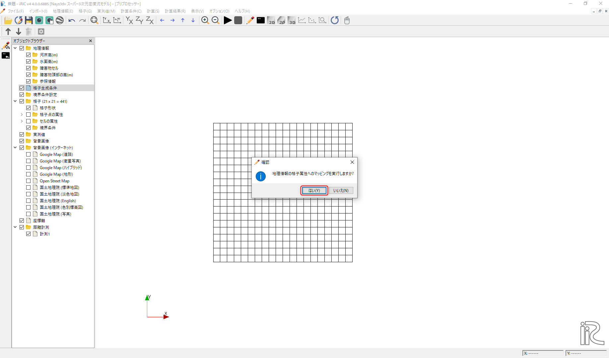

   : マッピング

--------------
計算条件の設定
--------------

メニューバーから[計算条件]→[設定]を選ぶと「計算条件」入力用のウィンドウが表示される :numref:`03_03_joken_1` 

.. _03_03_joken_1:

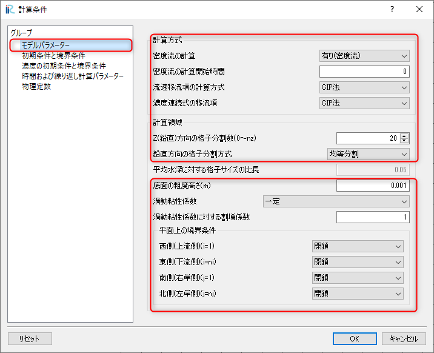

   : 計算条件：モデルパラメータ

「計算条件」ウィンドウ :numref:`03_03_joken_1` の「モデルパラメータ」は図の赤で囲った部分を設定する。
本計算は密度流なので、「密度流の計算」を[有り]に設定する。
流れの渦動粘性係数は[一定]とする。

.. _03_03_joken_2:

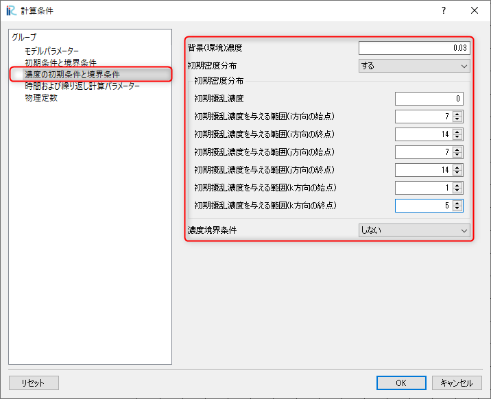

   : 計算条件：濃度の初期条件と境界条件

「計算条件」の「濃度の初期条件と境界条件」は、立方体の下部中央に密度の軽い液体を配置するので、
:numref:`03_03_joken_2` の赤囲いのように設定する。

.. _03_03_joken_3:

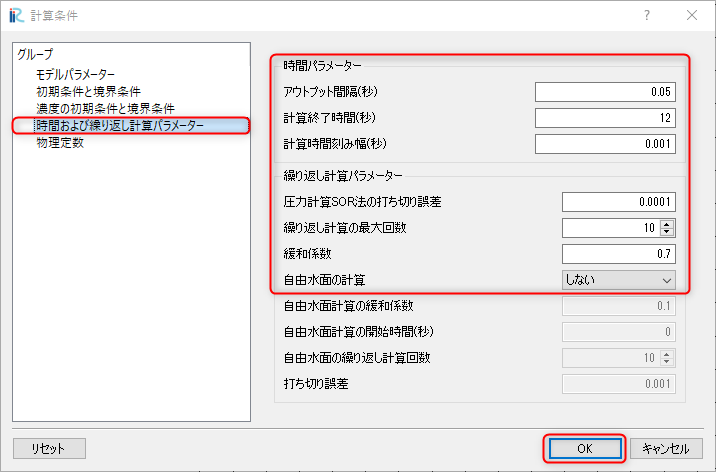

   : 計算条件：時間およに繰り返し計算パラメーター

「計算条件」の「時間およに繰り返し計算パラメーター」は、
:numref:`03_03_joken_3` の赤囲いのように設定する。自由水面の計算は[しない]に設定する。

設定が終了したら、[保存して閉じる]を押す。

------------
計算の実行
------------

.. _03_03_jikko_1:

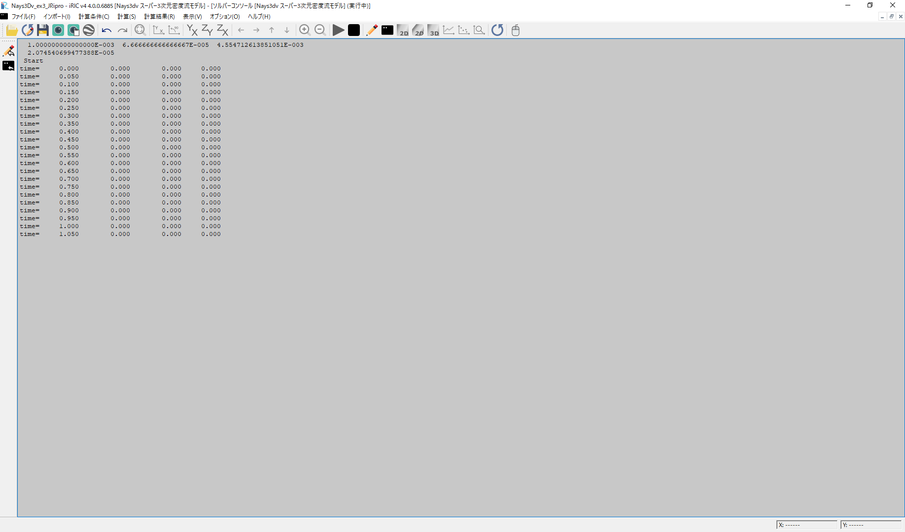

   :計算実行中の画面

[計算]→[実行]を指定すると、:numref:`03_03_jikko_1` のような画面が現れ計算が始まる。

.. _03_03_jikko_2:

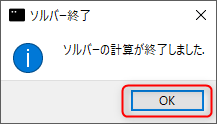

   :計算の終了

計算が終了すると, :numref:`03_03_jikko_2` のような表示がされる。

-------------------------
計算結果の表示
-------------------------

計算の終了後、[計算結果]→[新しい可視化ウィンドウ(3D)を開く]を選ぶことによって、可視化ウィンドウ(3D)が現れる。

.. _03_03_kekka_1:

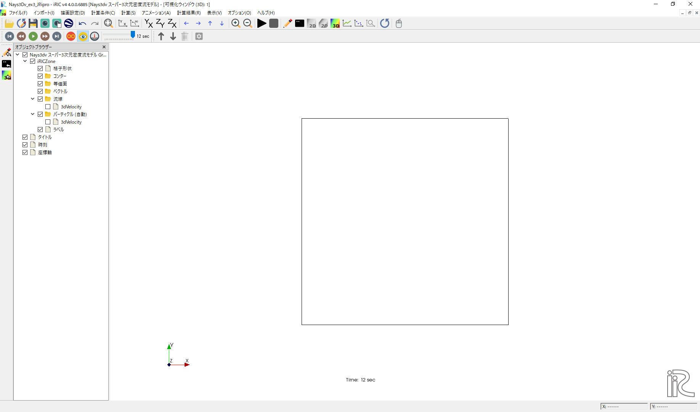

   : 計算結果の表示(1)
 

「Ctrl」ボタンとマウス右ボタンを押しながらマウスを上下左右に動かすことによって、
3次元的な見え方が、また、マウスぼセンターダイヤを回すことにより、 :numref:`03_03_kekka_2` のような
拡大・縮小が可能となっている。

.. _03_03_kekka_2:

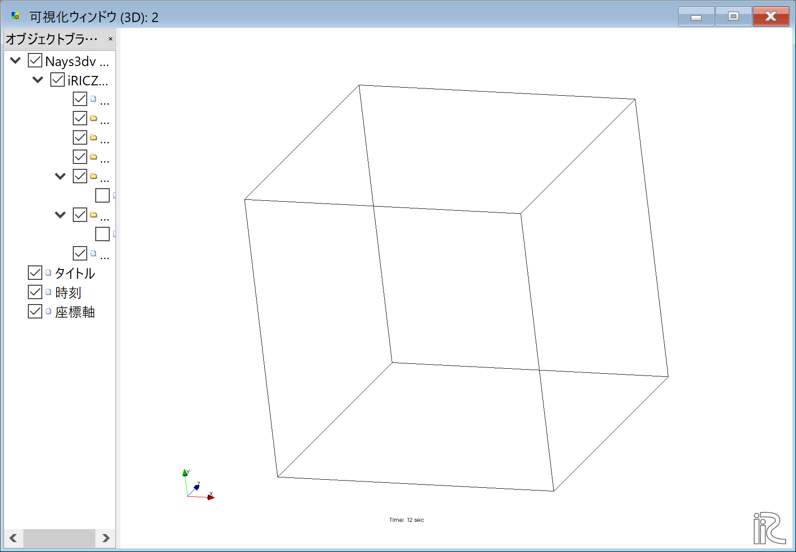

   : 3D格子の回転・移動・拡大・縮小
 

^^^^^^^^^^^^^^^^^^^^^^
ベクトル表示の設定
^^^^^^^^^^^^^^^^^^^^^^

オブジェクトブラウザーで、[ベクトル]を右クリックして、[プロパティ]をクリックすると、
「ベクトル設定」ウィンドウ :numref:`03_03_kekka_3` が現れる。

.. _03_03_kekka_3:

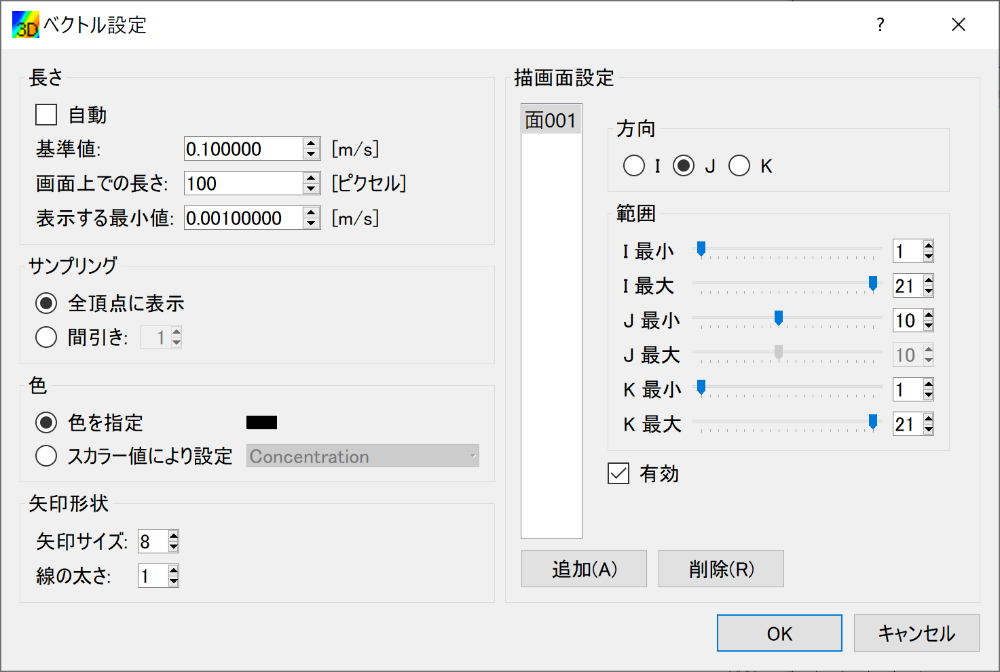

   : ベクトルの設定
 

:numref:`03_03_kekka_3` のようにベクトルに関する各パラメータを設定し、[OK]ボタンを押す。

^^^^^^^^^^^^^^^^^^^^^^^
等値面表示の設定
^^^^^^^^^^^^^^^^^^^^^^^

オブジェクトブラウザーで、[等値面]を右クリックして、[追加]をクリックすると、
「等値面設定」ウィンドウ :numref:`03_03_kekka_4` が現れる。 これを図のように設定する。

.. _03_03_kekka_4:

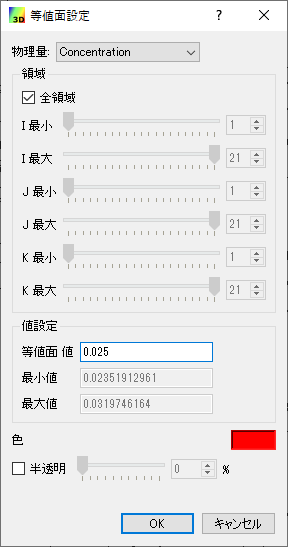

   : 等値面の表示
 
^^^^^^^^^^^^^^^^^^^^^^^^^^^^^^^^^^
計算結果の表示およびアニメーション
^^^^^^^^^^^^^^^^^^^^^^^^^^^^^^^^^^

「可視化ウィンドウ(3D)」 :numref:`03_03_kekka_5` でタイムバーをゼロに戻して、[アニメーション]→[開始/停止]で
計算結果をアニメーションで見ることが出来る。

.. _03_03_kekka_5:

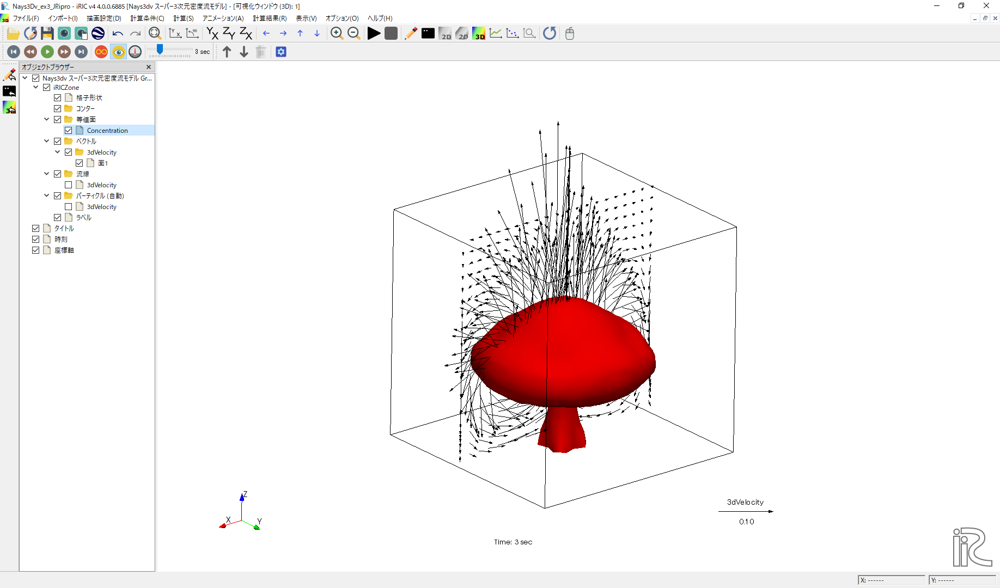

   : アニメーション
 

.. figure:: images/03/ex3.gif

アニメーションはiRICメインウィンドウ左上にあるプレイボタン等で操作も可能である。:numref:`03_03_kekka_6` 

.. _03_03_kekka_6:

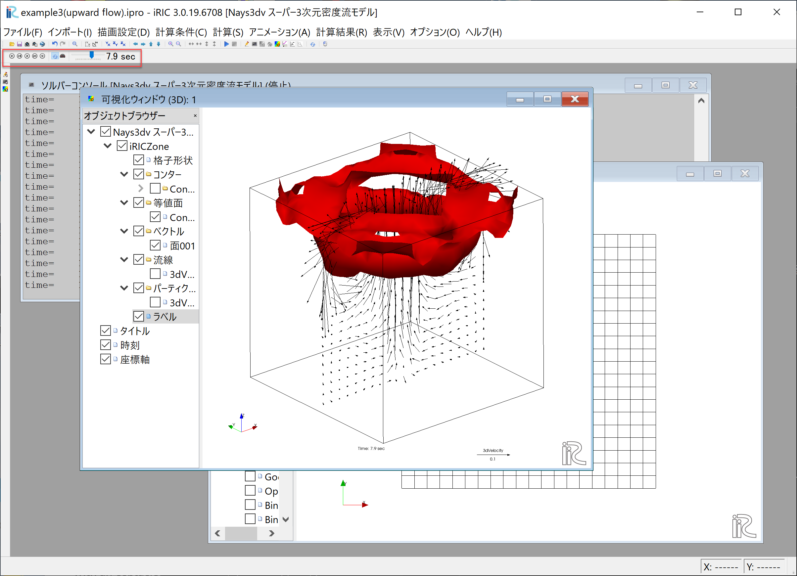

   : アニメーション
 

 

