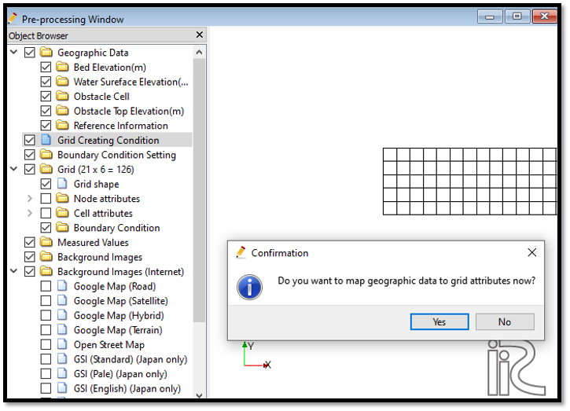
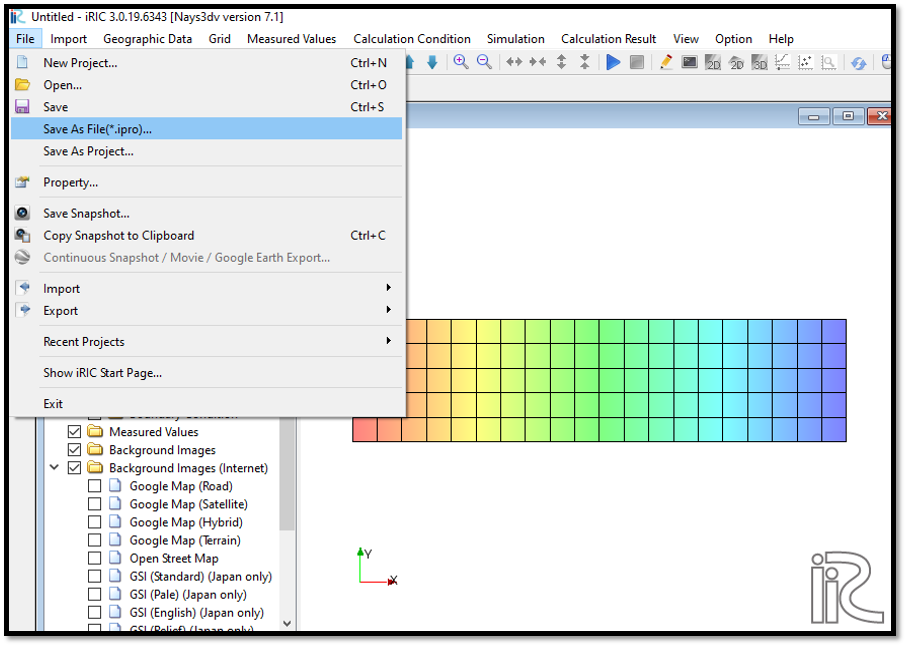
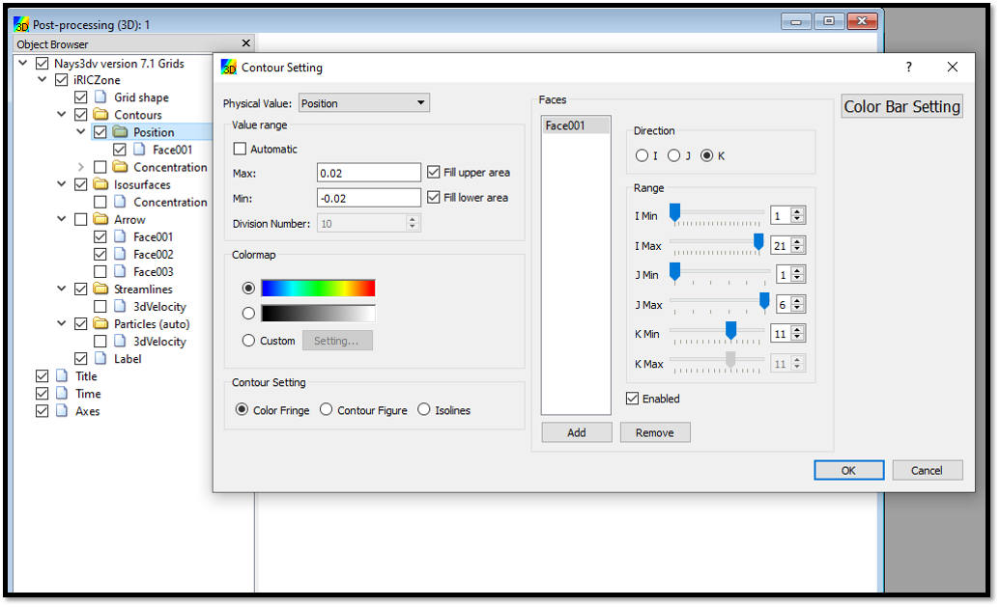
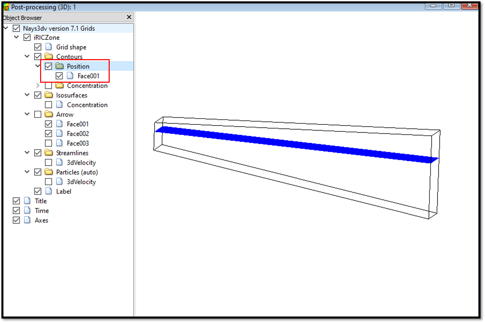
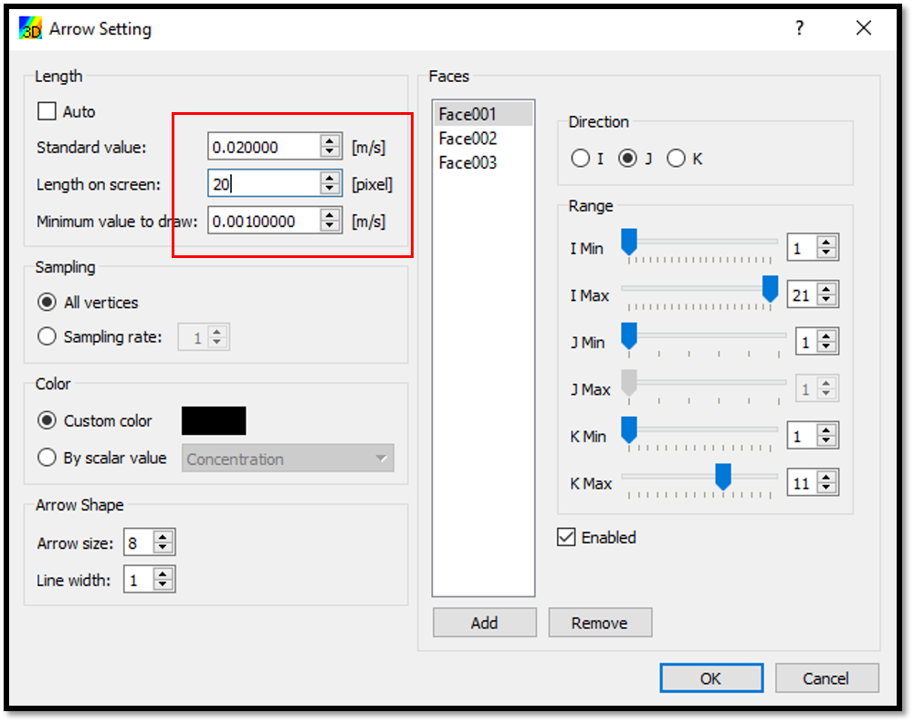

Example 04: 3D density currents in a closed tank with sloped bottom
================================================================================
Purpose
---------
Calculate the vertical 3D flow over a sloped bottom.
In this example a sloped channel with closed boundaries is used. No concentration boundary is given. However, initial concentration is given. 

Creation of the calculation grid and setting the initial conditions
------------------------------------------------------------------------
As explained in the other examples and the introduction, create the grid using, [Grid], [Select Algorithm to Create Grid] and then select [Grid Generator for Nays3DV].
Then the grid creation window will appear.

In grid creation window, give Chanel Shape parameters as shown in :numref:`image_04_Grid_Creation_01`.

.. _image_04_Grid_Creation_01:

   : Grid creation : Channel shape parameters

Then we can give channel bed condition. As here we use the default condition flat(no bar) no modifications are needed.

If new grids are added or width is varied it is possible to set them. As in this example no grids added and no width variations, no modifications are needed in them.

Initial water surface profile tab is used to give downstream depth, water surface slope and initial water surface purtavation.  It can be seen as shown in :numref:`image_04_Grid_Creation_02` and click on [Create Grid]. Here the bed is given as a sloped bed varying linearly in x direction.

.. _image_04_Grid_Creation_02:

   : Grid creation : Bed elevation and Depth

Then the grid is created and a confirmation message box will appear asking to map the geographic data as shown in :numref:`image_04_Grid_Creation_03` and click on [Yes].

.. _image_04_Grid_Creation_03:

   : Grid creation : Mapping geographic data to the grid

This will map the geographic data to the grid and the mapped grid can be seen as shown in :numref:`image_04_Grid_Creation_04`. 

.. _image_04_Grid_Creation_04:

   : Grid creation : Mapping geographic data to the grid

Save the project with [File], [Save as .ipro] or [Save as Project] as in :numref:`image_04_Save`. 

.. _image_04_Save:

   : Save as ipro

Setting the calculation conditions and simulation
---------------------------------------------------
Set the calculation conditions with [Calculation Condition], [Setting].

Calculation condition window will open.

Set computational parameters as shown in :numref:`image_04_Calculation_condition_01`.

.. _image_04_Calculation_condition_01:

   : Calculation Condition : Computational Parameters

Then give hydraulic boundary conditions. Since the boundary conditions are closed boundaries , boundary condition window is inactive as shown in :numref:`image_03_Calculation_condition_02`.

.. _image_04_Calculation_condition_02:

   : Calculation Condition : Boundary Conditions

Then give initial and boundary concentrations as shown in :numref:`image_04_Calculation_condition_03`. 

.. _image_04_Calculation_condition_03:

   : Calculation Condition : Initial and Boundary Concentrations

Here initial density distribution is given in calculation conditions. For that the i, j, k start and end locations of the purturbed concentration should be given as shown in above figure.
 
Then the time and iteration parameters are give as shown in :numref:`image_03_Calculation_condition_04`. 

.. _image_04_Calculation_condition_04:

   : Calculation Condition : Time and Iteration parameters

Then give the physical parameters as given in :numref:`image_04_Calculation_condition_05`. 

.. _image_04_Calculation_condition_05:

.. figure:: images/04/04_Calculation_condition_05.png
   :width: 400pt

   : Calculation Condition : Physical Parameters

After setting the calculation conditions, save and close the calculation condition window. 

Save the project again. Now start the simulation by [Simulation], [Run].

Visualization of results
-------------------------

After calculation solver stopped, go to [Calculation Results], [Open new 3D Post-Processing Window].

In this example, water surface position, concentration and arrows will be plotted.
For that, [Object Browser] - [iRICZone] - [Contours] right click on contours and [Add]. Then the contour setting window will appear as shown in :numref:`image_04_Visualization_of_results_01`. Select [position] in value setting. Add face and set their domain as shown in figure.

.. _image_04_Visualization_of_results_01:

   : Visualization of results : Contour Setting. 

After the contour setting for the position, plot will be as shown in :numref:`image_04_Visualization_of_results_02`.

.. _image_04_Visualization_of_results_02:

   : Visualization of results : Position

To set the concentration, [Object Browser] - [iRICZone] - [Contours] right click on contours and [Add]. Then the contour setting window will appear as shown in :numref:`image_04_Visualization_of_results_03`. Select [Concentration] in value setting. Add face and set their domain as shown in figure. For the colour setting use custom colour settings as shown in figure. Here three colors are used.

.. _image_04_Visualization_of_results_03:

   : Visualization of results : Contour Setting for Concentration. 

After the contour setting for the concentration, plot will be with position and concentration as shown in :numref:`image_04_Visualization_of_results_04`.

.. _image_04_Visualization_of_results_04:

   : Visualization of results : Concentration and water surface position 
 
Then add the arrows to the plot. For that, right click on arrows and arrow setting will appear as shown in :numref:`image_04_Visualization_of_results_06`.

.. _image_04_Visualization_of_results_06:

   : Visualization of results : Arrow setting

After the arrow setting the plot will be with position of water surface, concentration and velocity vectors as shown in :numref:`image_04_Visualization_of_results_07`.

.. _image_04_Visualization_of_results_07:

   : Visualization of results

The animation of the movement can be viewed with animation buttons in top of the 3D post-processing window.
