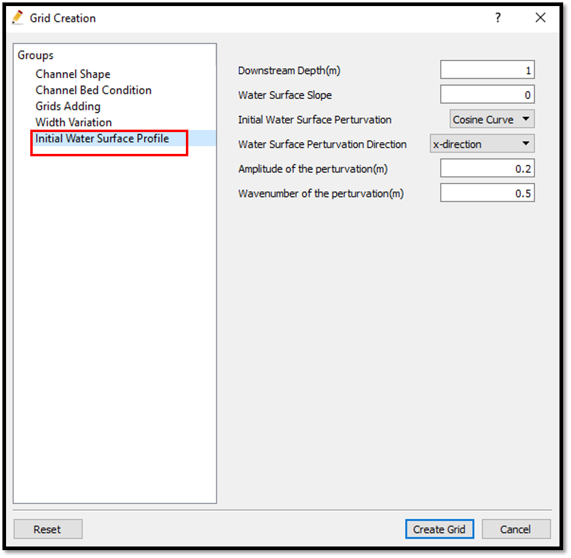
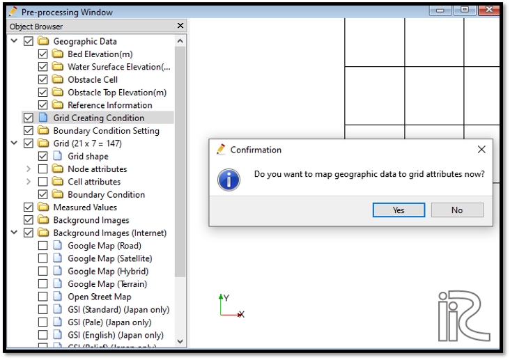
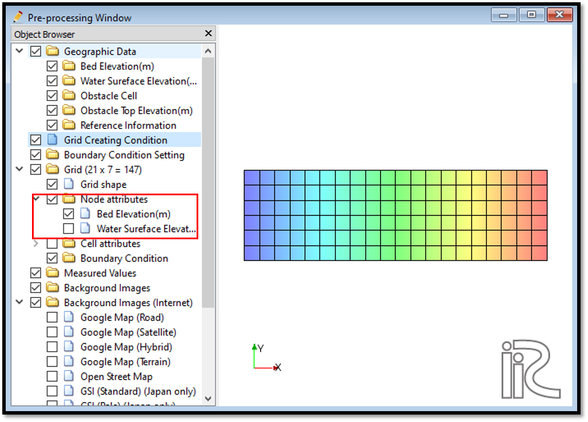
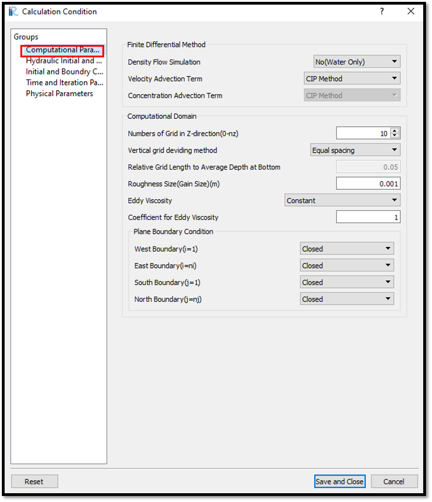
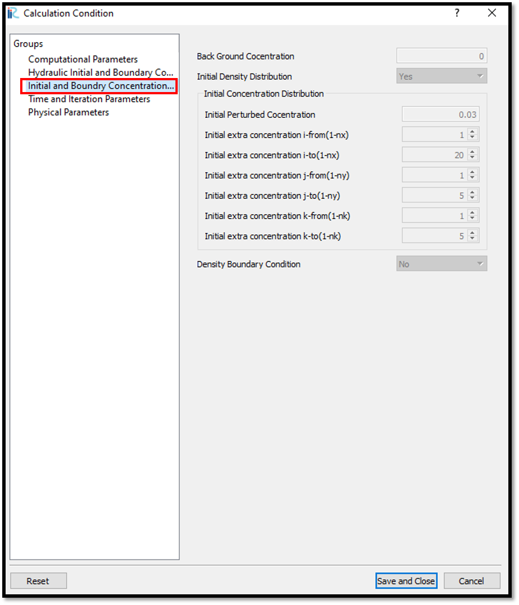
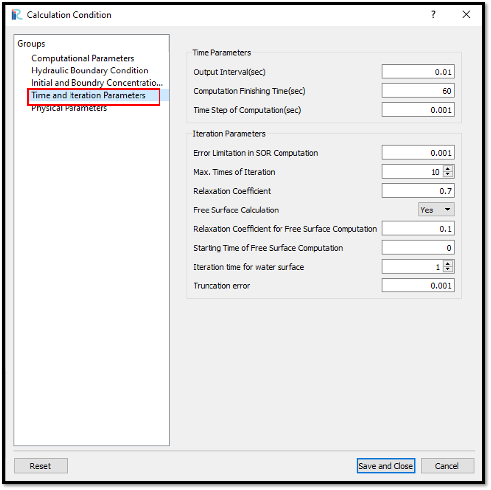
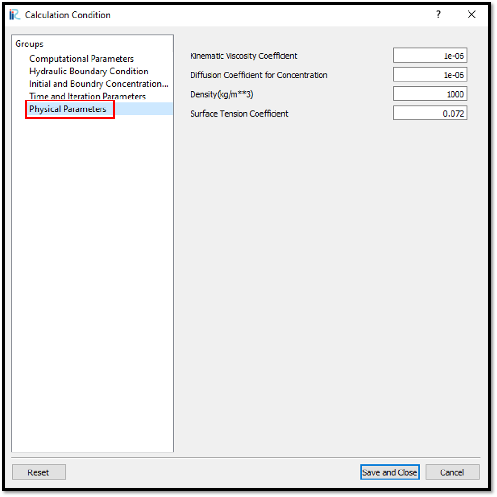
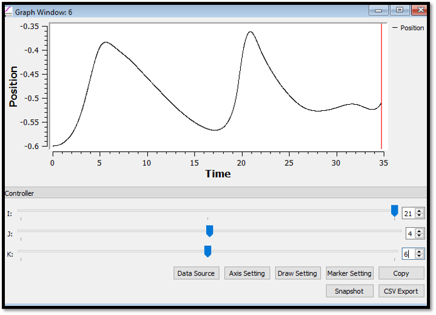

Example 05 : Free surface in a 3D density tank
=================================================================

Purpose
---------
To calculate free surface in a closed channel. 
In ths example channel is a closed channel with a sloping bed and initial water surface is a purtubed as a cosine shape. Only water is simulated. No density flow.

Creation of calculation grid and setting initial conditions
-----------------------------------------------------------
As explained in the other examples and the introduction, create the grid using, [Grid], [Select Algorithm to Create Grid] and then select [Grid Generator for Nays3DV].
Then the grid creation window will appear.

In grid creation window, give channel shape parameters as shown in :numref:`image_05_Grid_Creation_01`.

.. _image_05_Grid_Creation_01:

   : Grid creation : Computational Domain

Then we can give channel bed condition. As here we use the default condition flat(no bar), no modifications are needed.

If new grids are added or width is varied it is possible to set them. As in this example no grids added and no width variations, no modifications are needed in them.

Initial water surface profile tab is used to give downstream depth, water surface slope and initial water surface purtavation.  It can be seen as shown in :numref:`image_05_Grid_Creation_02`. After setting all the parameters click on [Create Grid]. Here the bed is given as a sloped bed varying linearly in x direction.

.. _image_05_Grid_Creation_02:

   : Grid creation : Bed elevation and Depth

Then the grid is created and a confirmation message box will appear asking to map the geographic data as shown in :numref:`image_05_Grid_Creation_03`  and click on [Yes].

.. _image_05_Grid_Creation_03:

   : Grid creation : Mapping geographic data to the grid

This will map the geographic data to the grid and the mapped grid can be seen as shown in :numref:`image_05_Grid_Creation_04`. 

.. _image_05_Grid_Creation_04:

   : Grid creation : Mapping geographic data to the grid

Setting the calculation conditions and simulation
---------------------------------------------------

Set the calculation conditions with, [Calculation Condition], [Setting].

Calculation condition window will open.

Set computational parameters as shown in :numref:`image_05_Calculation_condition_01`.

.. _image_05_Calculation_condition_01:

   : Calculation Condition : Computational Parameters

Then give hydraulic boundary conditions. Since the boundary conditions are closed boundaries , boundary conditions are inactive as shown in :numref:`image_05_Calculation_condition_02`. However, initial water surface elevation is given as read from geomatric data.

.. _image_05_Calculation_condition_02:

   : Calculation Condition : Boundary Conditions

As only water is modeled, initial and boundary concentrations window is inactive as shown in :numref:`image_05_Calculation_condition_03`. 

.. _image_05_Calculation_condition_03:

   : Calculation Condition : Initial and Boundary Concentrations

  
Then the time and iteration parameters are given as shown in :numref:`image_05_Calculation_condition_04`. Here as we calculate the free surface boundary , need to set yes for free surface calculation. 

.. _image_05_Calculation_condition_04:

   : Calculation Condition : Time and Iteration parameters

Then give the physical parameters as given in :numref:`image_05_Calculation_condition_05`. 

.. _image_05_Calculation_condition_05:

   : Calculation Condition : Physical Parameters

After giving the calculation conditions, [Save and close].

Save the whole project one more time with clicking on save icon and start to run the program by, [Simulation] [Run]. Program will start to run.

When the simulation is finished, a dialogue box will appear with the message simulation stopped.

Visualization of results
-------------------------

Now go to  3D post processing icon or [Calculation Result][Open new 3D Post-Processing Window]. 
The 3D post processing window will appear.
 

In this example plotting the graphs will be demonstrated. For that, select the line graph icon as shown in :numref:`image_05_Visualization_of_results_01`. Then the data source setting window will apear as in the figure.

.. _image_05_Visualization_of_results_01:

.. figure:: images/05/05_Visualization_of_results_01.png
   :width: 100%

   : Visualization of results : 

Then select the x axis (Here it is selected as time). It is possible to select as Time, i, j or k. Then need to select the data need to be plotted in y axis from the three dimensional data set and click on Add. Then that parameter will move to selected data side. Here it is position. Therefore, our plot will be Position vs Time as shown in :numref:`image_05_Visualization_of_results_02`. 

.. _image_05_Visualization_of_results_02:

   : Visualization of results : 

As shown in the down of the figure, we can select the i, j, k locations we need to check from the controller by controler bar or typing in the box. Here i = 21, j = 4 and k = 6. Likewise it is possible to plot any location.

There are several options we can do for graphs as shown in the above figure such as csv export, snap shot, axis setting, marker setting etc.

Then if the distance and position need to be plotted, click on the graph icon as before and select x axis as i and y axis from the three dimensional data. Here position is slected as shown in :numref:`image_05_Visualization_of_results_03`. 

.. _image_05_Visualization_of_results_03:

   : Visualization of results : 

Therefore, our plot will be Position vs Distance as shown in :numref:`image_05_Visualization_of_results_04`. 

.. _image_05_Visualization_of_results_04:

   : Visualization of results : 
