[計算例 5] 下流端水位の上下により蛇行水路内を遡上・流下する塩水楔
============================================================================

感潮河川では、潮の干満により河口水位が上下に振動し、これによって海水(塩水)が河川に侵入および、
流下を繰り返す。河川の水理条件によっては楔状の塩淡境界が河道内を移動する。
ここでは、単純なSine Genrlated Curve内を行き来する塩水楔のシミュレーションを行う。

--------------
計算格子の生成
--------------

計算格子の作成はNays3dv専用の格子生成ツールを用いる。 :numref:`03_05_koshi_1` 
で[Nays3dv用格子生成ツール]を選択し。[OK]をクリックする。

.. _03_05_koshi_1:

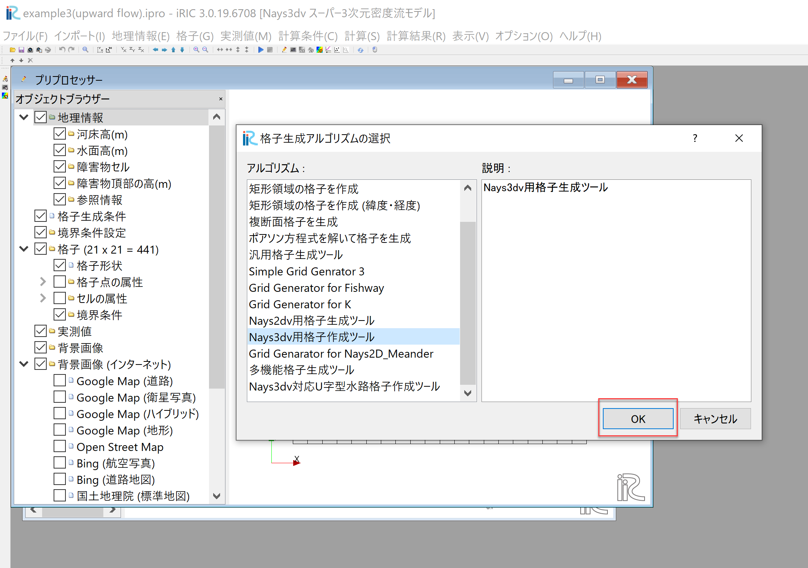

   : 格子生成アルゴリズムの選択

「格子生成」ウィンドウが現れるので、[計算領域(流路)形状]を選び、
流路形状は[Sine Generated曲線]をその他の流路形状パラメーターは下の :numref:`03_05_koshi_2` で赤囲いの部分を設定する。

.. _03_05_koshi_2:

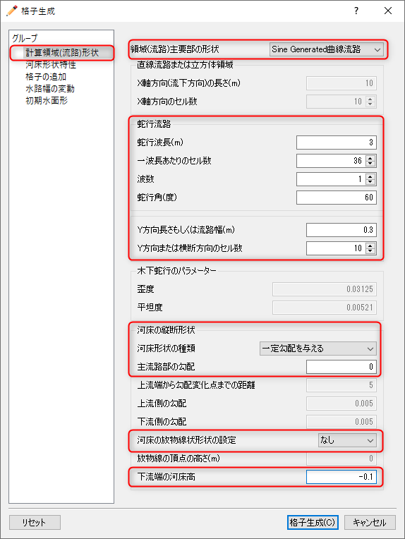

   : 格子生成: 計算領域(流路)形状

次に、「格子の追加」を選ぶ。上下流に直線部を追加するので、
下図 :numref:`03_05_koshi_3` で赤囲いの部分を設定する。

.. _03_05_koshi_3:

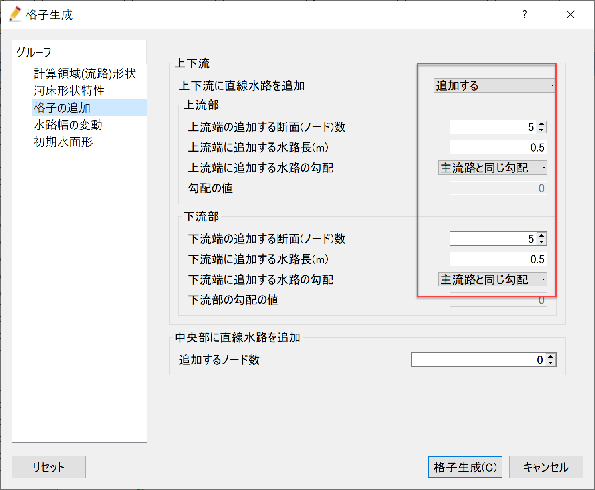

   : 格子生成： 格子の追加

最後に、初期水面形を選ぶ。 初期水位は水平とするので、下の 下図 :numref:`03_05_koshi_4` 
で赤囲いの部分を設定すし、最後に、[格子生成]をクリックすると、格子が生成される。

.. _03_05_koshi_4:

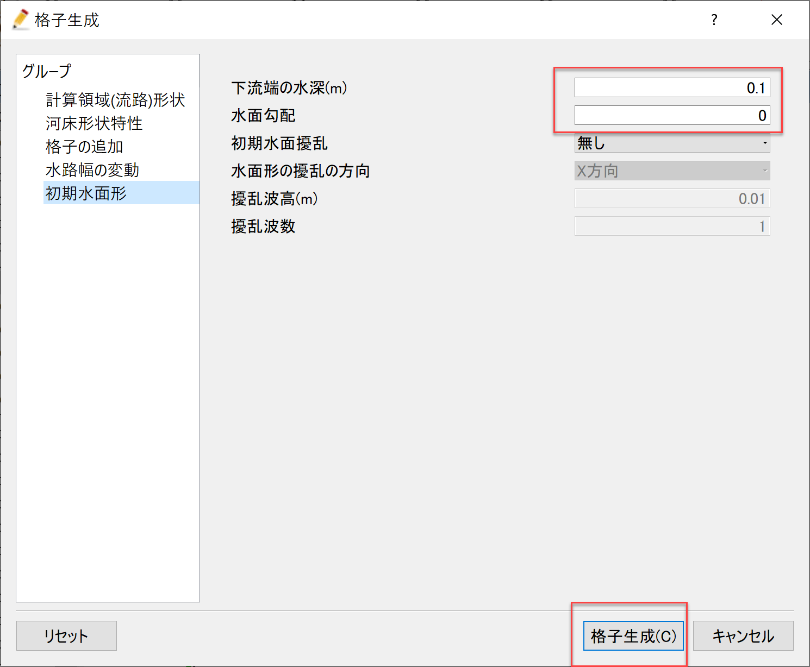

   : 格子生成： 初期水面形

:numref:`03_05_koshi_5` が現れ、「マッピングしますか？」と聞かれるので、
[はい(Y)]を選択すると、格子生成が完了する。

.. _03_05_koshi_5:

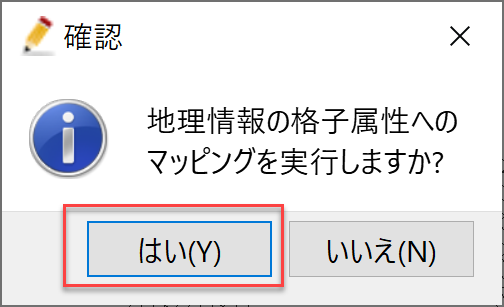

   : マッピング

「プリプロセッサー」ウィンドウに蛇行流路の格子が現れたら、オブジェクトブラウザーで
[境界条件設定]→[濃度境界条件の追加]を選び( :numref:`03_05_koshi_6` )、

.. _03_05_koshi_6:

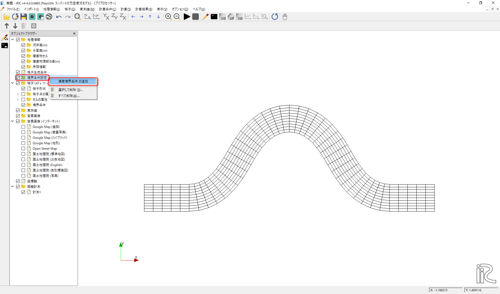

   : プリプロセッサー：濃度境界条件の追加

下図 :numref:`03_05_koshi_7` のように、下流端の断面を囲うようにクリックして「濃度境界を与える辺」を指定し、
最後に[Enter]を押す。

.. _03_05_koshi_7:

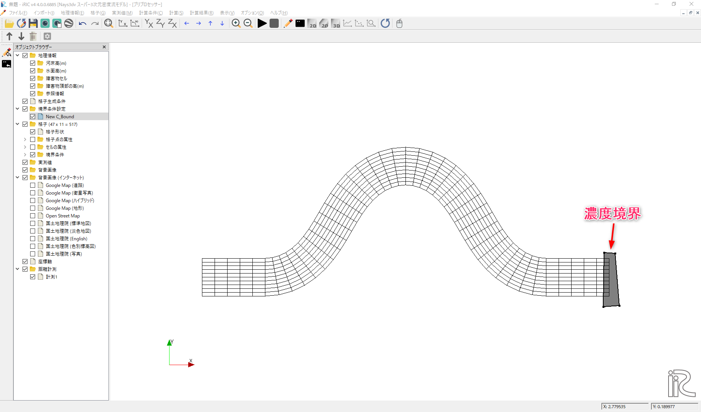

   : プリプロセッサー：濃度境界条件の追加

下図 :numref:`03_05_koshi_8` が現れるので、「境界条件濃度を」[0.03]に、
濃度境界条件を与える高さ(m)を[-0.05]とする。本計算例では下流端の水位が初期で0m, 河床高が-0.1mとした
ので、「濃度境界条件を与える高さ」を[-0.05]mとすることによって、-0.05mの高さまでが境界条件で
海水となることを表す。設定が終了したら[OK]を押す。

.. _03_05_koshi_8:

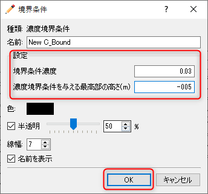

   : プリプロセッサー：濃度境界条件

--------------
計算条件の設定
-------------- 

メニューバーから[計算条件]→[設定]を選ぶと「計算条件」入力用のウィンドウが表示される :numref:`03_05_joken_1` 

.. _03_05_joken_1:

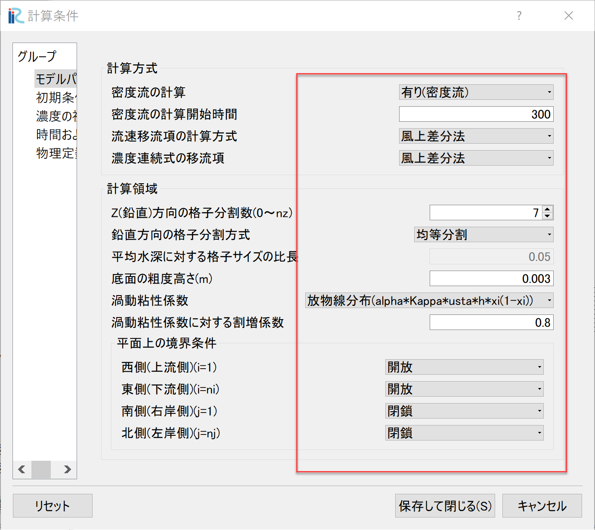

   : 計算条件：モデルパラメータ

「計算条件」ウィンドウ :numref:`03_05_joken_1` の「モデルパラメータ」は図の赤で囲った部分を設定する。
本計算は密度流なので、「密度流の計算」を[有り]に, ここでは「差分式」を[風上差分]、「鉛直方向の分割数」は [7]
とする。流れの渦動粘性係数は流速の対数分布に対応する[放物線分布]とする。

.. _03_05_joken_2:

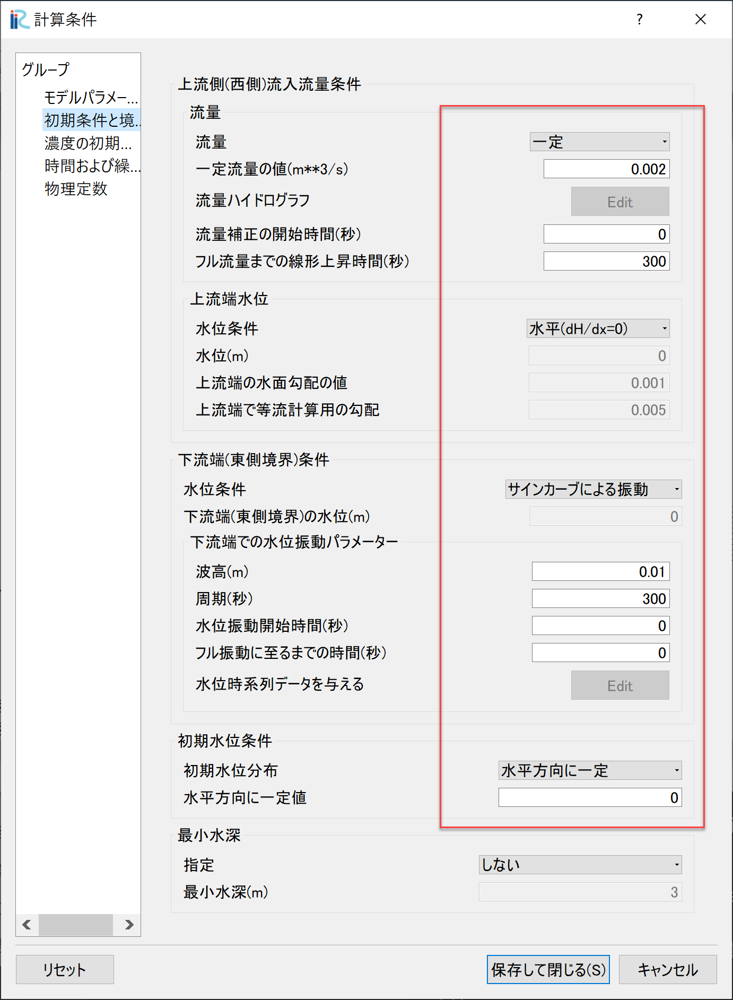

   : 計算条件：濃度の初期条件と境界条件

「計算条件」の「初期条件と境界条件」は、河川流量は一定、下流端は周期的な振動とするので、
:numref:`03_05_joken_2` の赤囲いのように設定する。

.. _03_05_joken_3:

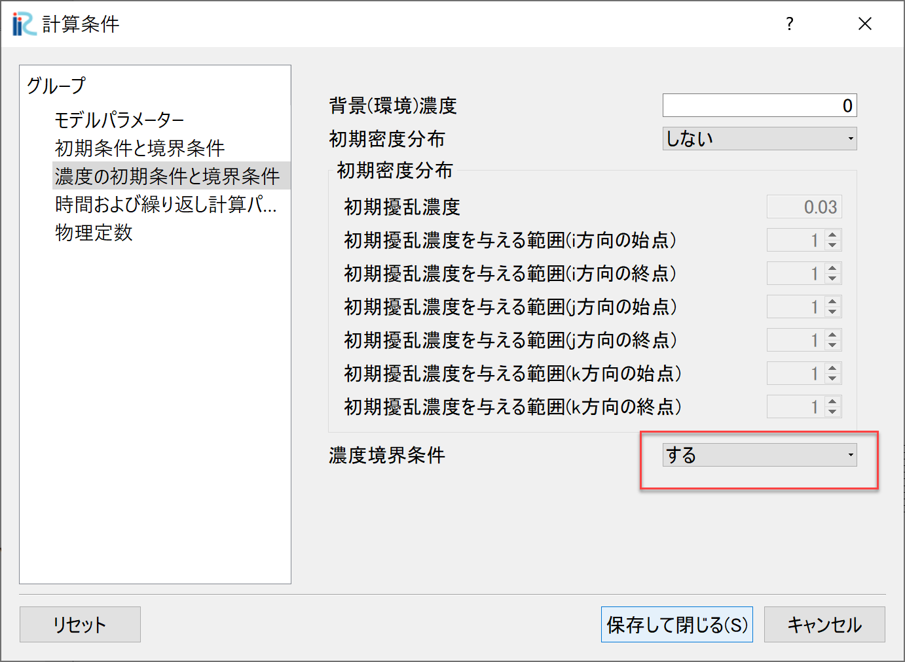

   : 計算条件：時間およに繰り返し計算パラメーター

「計算条件」の「濃度の初期条件と境界条件」下流端の濃度境界のみ考慮するので、
:numref:`03_05_joken_3` の赤囲いのように設定する。

.. _03_05_joken_4:

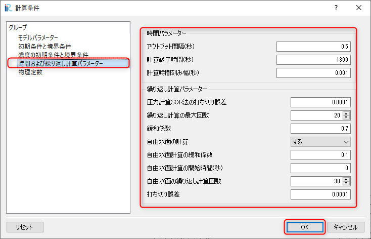

   : 計算条件：時間およに繰り返し計算パラメーター

「計算条件」の「時間およに繰り返し計算パラメーター」は、
:numref:`03_05_joken_4` の赤囲いのように設定する。下流端の水位変動が上流に及ぶ
ことによる塩水楔の移動なので、自由水面の計算は[する]に設定する。

設定が終了したら、[保存して閉じる]を押す。

------------
計算の実行
------------

.. _03_05_jikko_1:

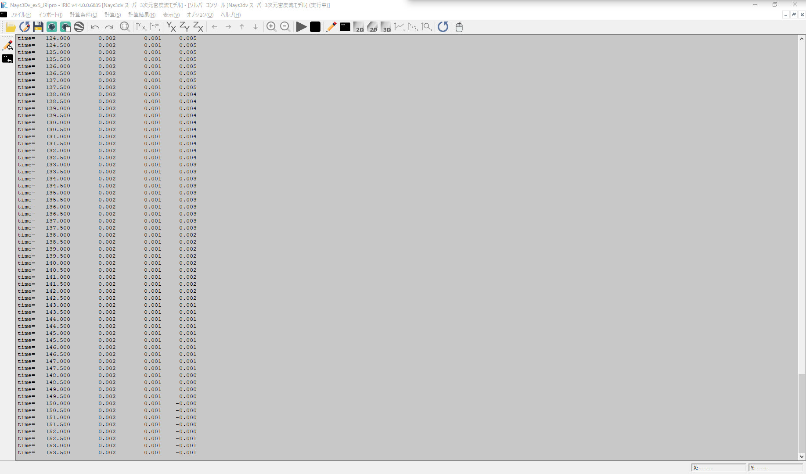

   :計算実行中の画面

[計算]→[実行]を指定すると、:numref:`03_05_jikko_1` のような画面が現れ計算が始まる。

.. _03_05_jikko_2:

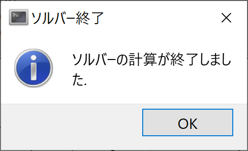

   :計算の終了

計算が終了すると, :numref:`03_05_jikko_2` のような表示がされる。

-------------------------
計算結果の表示
-------------------------

計算の終了後、[計算結果]→[新しい可視化ウィンドウ(3D)を開く]を選ぶことによって、可視化ウィンドウ(3D)が現れる。

.. _03_05_kekka_1:

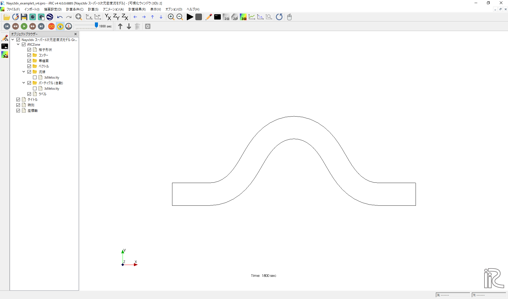

   : 計算結果の表示(1)
 

「Ctrl」ボタンとマウス右ボタンを押しながらマウスを上下左右に動かすことによって、
3次元的な見え方が、また、マウスぼセンターダイヤを回すことにより、 :numref:`03_05_kekka_2` のような
拡大・縮小が可能となっている。

.. _03_05_kekka_2:

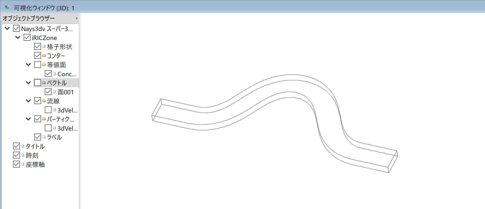

   : 3D格子の回転・移動・拡大・縮小
 
Z方向の表示を拡大したい場合は、メニューバーから[表示]→[Z方向の倍率]を選んで、( :numref:`03_05_kekka_3` ) 

.. _03_05_kekka_3:

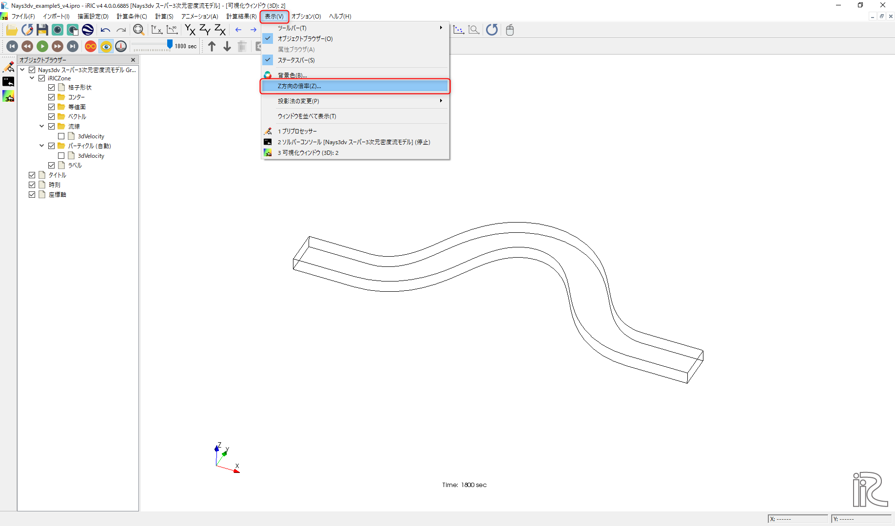

   : Z方向の倍率
 

任意の倍率(ここでは2)を入力して、[OK]を押す。( :numref:`03_05_kekka_4` ) 

.. _03_05_kekka_4:

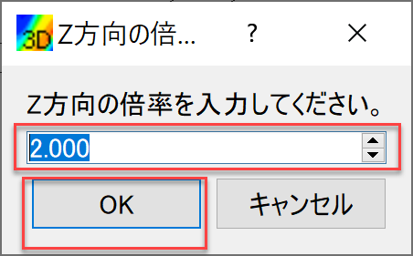

   : Z方向の倍率の指定

^^^^^^^^^^^^^^^^^^^^^^
ベクトル表示の設定
^^^^^^^^^^^^^^^^^^^^^^

オブジェクトブラウザーで、[ベクトル]を右クリックして、[プロパティ]をクリックすると、
「ベクトル設定」ウィンドウ :numref:`03_05_kekka_5` が現れる。

.. _03_05_kekka_5:

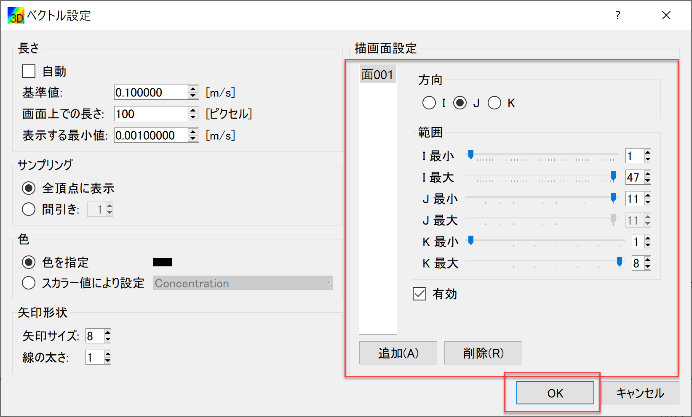

   : ベクトルの設定
 

:numref:`03_05_kekka_5` のようにベクトルに関する各パラメータを設定し、[OK]ボタンを押す。

^^^^^^^^^^^^^^^^^^^^^^^
等値面表示の設定
^^^^^^^^^^^^^^^^^^^^^^^

オブジェクトブラウザーで、[等値面]を右クリックして、[追加]をクリックすると、
「等値面設定」ウィンドウ :numref:`03_05_kekka_6` が現れる。 これを図のように設定して[OK]を押す。

.. _03_05_kekka_6:

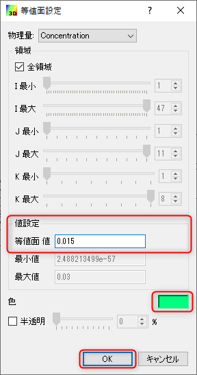

   : 等値面の表示
 
^^^^^^^^^^^^^^^^^^^^^^^^^^^^^^^^^^
計算結果の表示およびアニメーション
^^^^^^^^^^^^^^^^^^^^^^^^^^^^^^^^^^

「可視化ウィンドウ(3D)」 :numref:`03_05_kekka_7` でタイムバーをゼロに戻して、[アニメーション]→[開始/停止]で
計算結果をアニメーションで見ることが出来る。

.. _03_05_kekka_7:

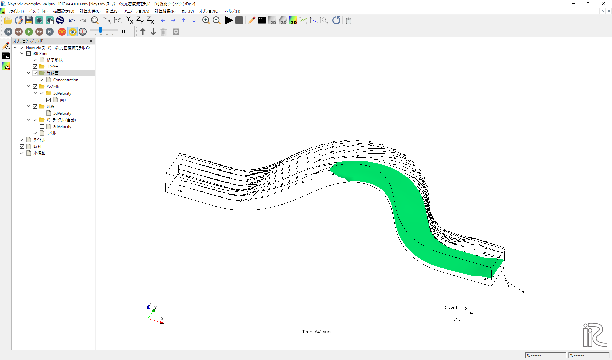

   : アニメーション
 

アニメーションはiRICメインウィンドウ左上にあるプレイボタン等で操作も可能である。:numref:`03_05_kekka_8` 

.. _03_05_kekka_8:

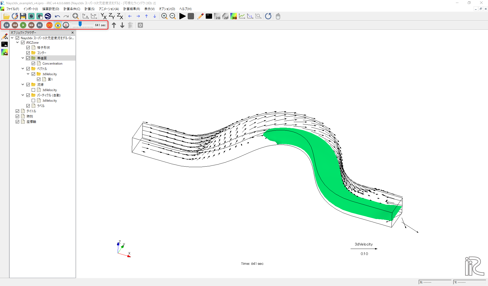

   : アニメーション
 

^^^^^^^^^^^^^
グラフの表示
^^^^^^^^^^^^^
下流端水位の時間変化を表示するグラフを作成する。
メニューから[計算結果]→[新しいグラフウィンドウを開く]をクリック :numref:`03_05_kekka_9` すると、

.. _03_05_kekka_9:

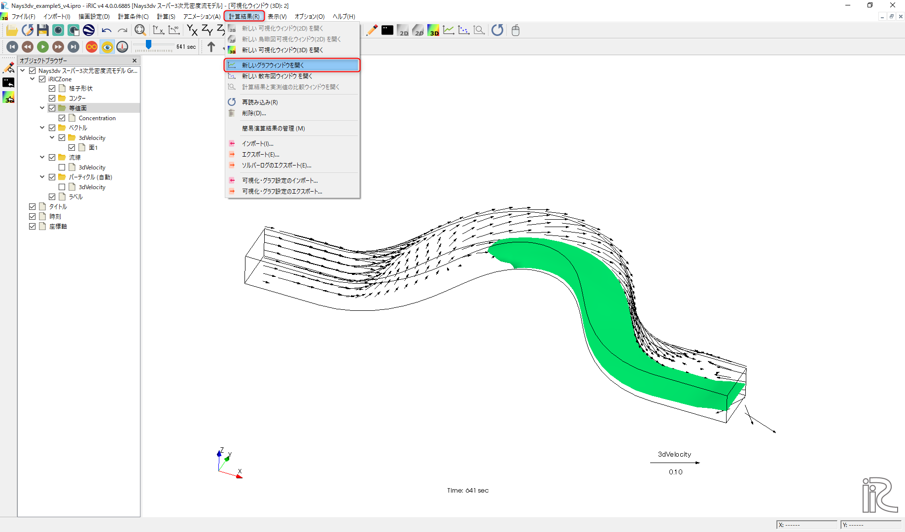

   :グラフウィンドウを開く

「データソース設定」のウィンドウ :numref:`03_05_kekka_10` が表示される。
「X軸】に[時刻]を、「計算結果」の「ポイントデータ」に[Dounstream Stage」を指定し、
[追加]をクックりっくする。

 .. _03_05_kekka_10:

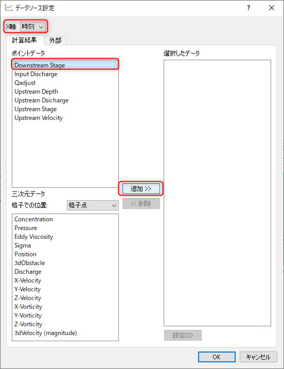

   :データソース設定(1)

「選択したデータ」に[Doenstream Stage]が移動するので、[OK]をクリックする. 
:numref:`03_05_kekka_11` 

.. _03_05_kekka_11:

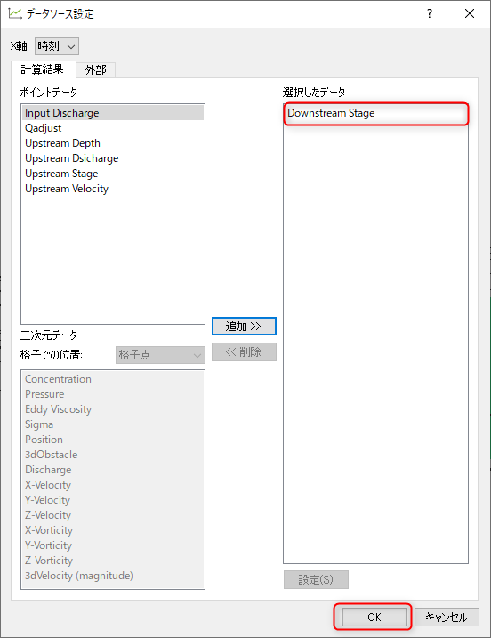

   :データソース設定(2)
  

下流端水位の時間変化グラフ :numref:`03_05_kekka_12` が表示される。 :numref:`03_05_kekka_12` 

.. _03_05_kekka_12:

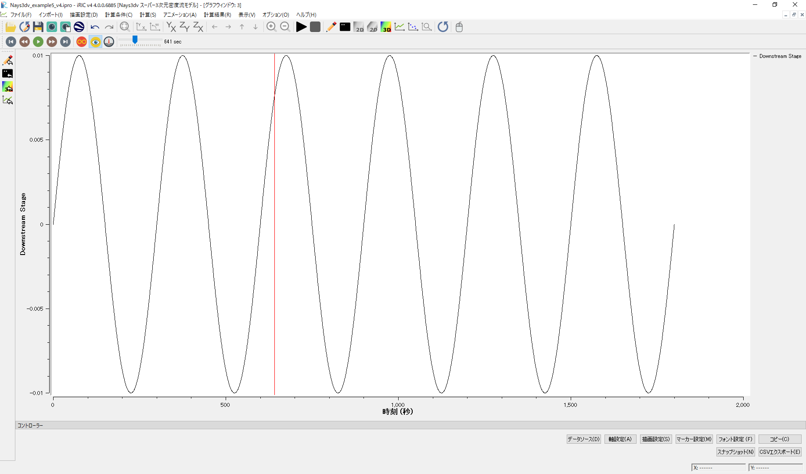

   :グラフウィンドウ(下流端水位の時間変化)
  

^^^^^^^^^^^^^^^^^^^^^^^^^
アニメーション動画の作成
^^^^^^^^^^^^^^^^^^^^^^^^^

可視化ウィンドウとグラフウィンドウをいつの画面に入れたアニメーションファイルを作成する。
メニューバーから[ファイル]→[連続スナップショット/動画/Google Earth出力]を選ぶ。
:numref:`03_05_kekka_13`

.. _03_05_kekka_13:

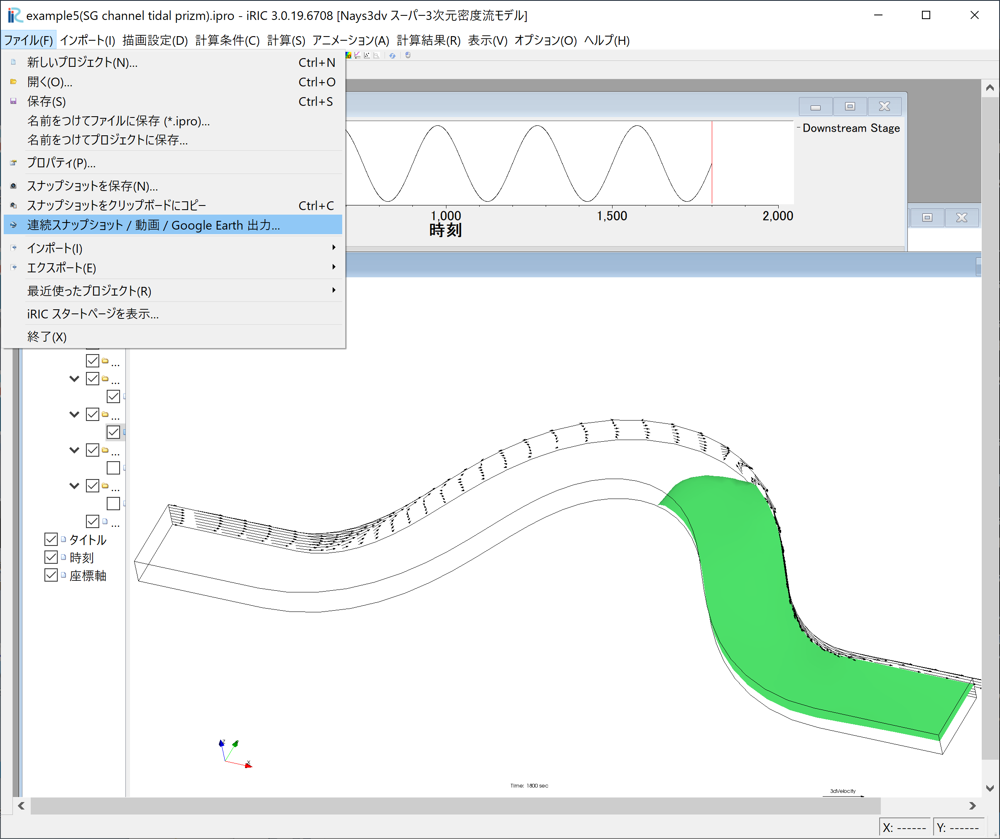

   :[連続スナップショット/動画/Google Earth出力]の選択

下図 :numref:`03_05_kekka_14` で[次へ]をクリック

.. _03_05_kekka_14:

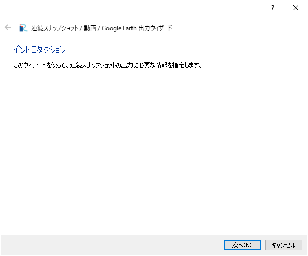

   :イントロダクション

下図 :numref:`03_05_kekka_15` で赤囲い部分をチェックして[次へ]をクリック

.. _03_05_kekka_15:

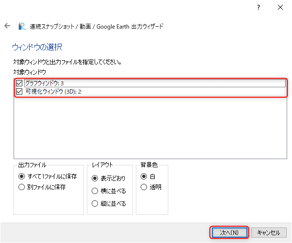

   :ウィンドウの選択

下図 :numref:`03_05_kekka_16` で画像と動画の出力フォルダを指定して[次へ]をクリック

.. _03_05_kekka_16:

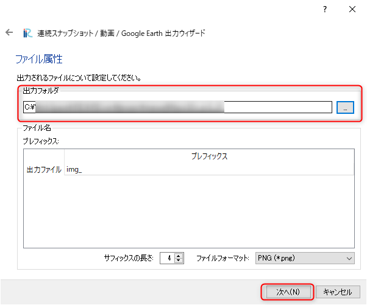

   :ファイル属性

下図 :numref:`03_05_kekka_17` で「動画ファイルに出力」をチェック、「動画の長さ」を
10秒にして、[次へ]をクリック

.. _03_05_kekka_17:

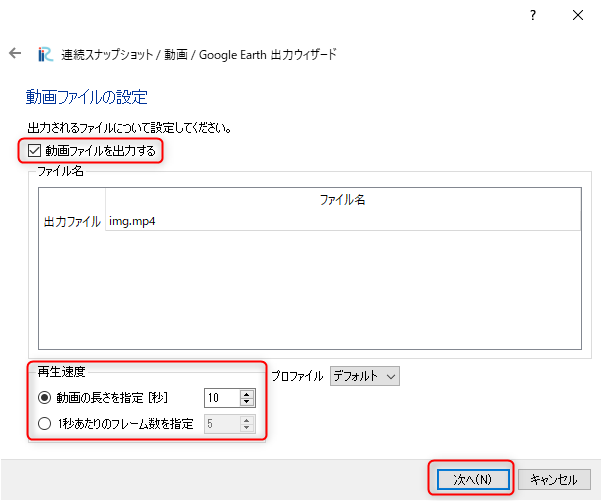

   :動画ファイルの設定

下図 :numref:`03_05_kekka_18` で[次へ]をクリック

.. _03_05_kekka_18:

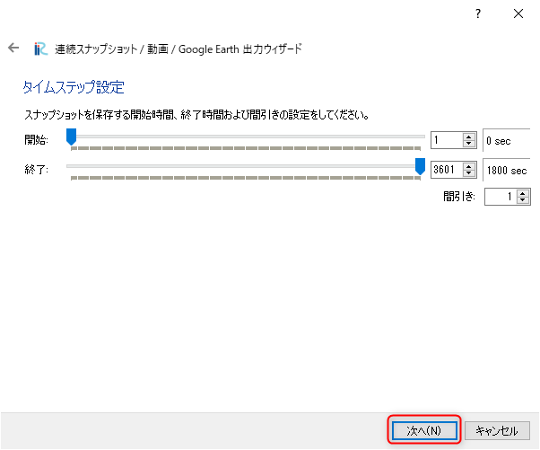

   :タイムステップ設定
 
下図 :numref:`03_05_kekka_19` で[次へ]をクリック

.. _03_05_kekka_19:

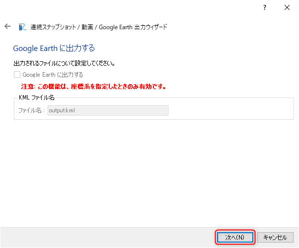

   :Google Earth 出力設定

下図 :numref:`03_05_kekka_20` で[完了]をクリック

.. _03_05_kekka_20:

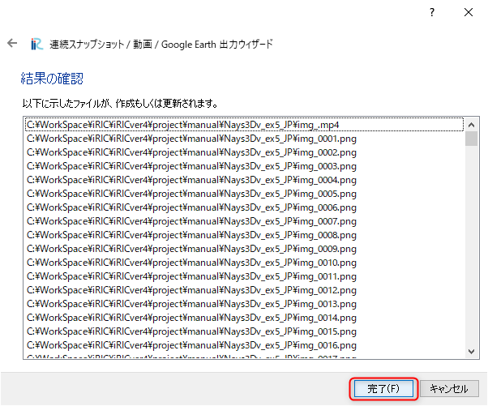

   :結果の確認

しばらく待つと、動画ファイルは、で画像と動画の出力フォルダの中の「image.mp4」というファイル名で
作成される。

.. figure:: images/05/ex5.gif

   :計算結果のアニメーション
