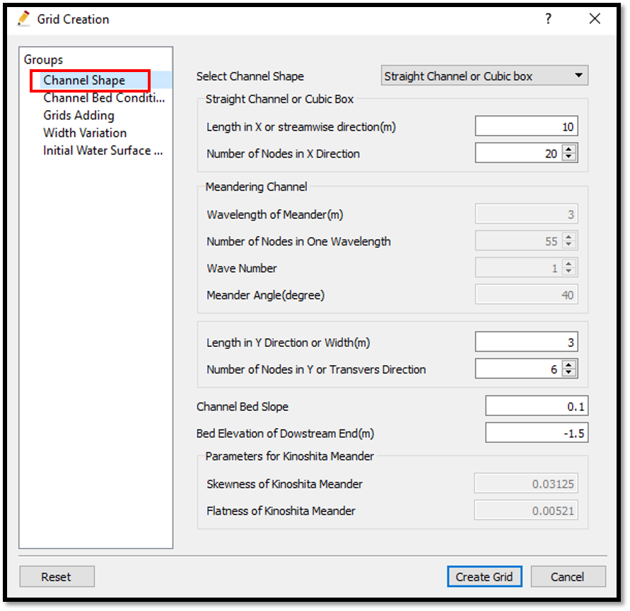
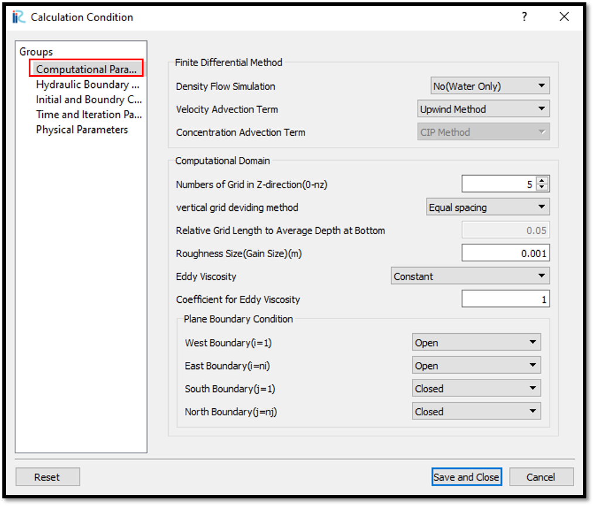
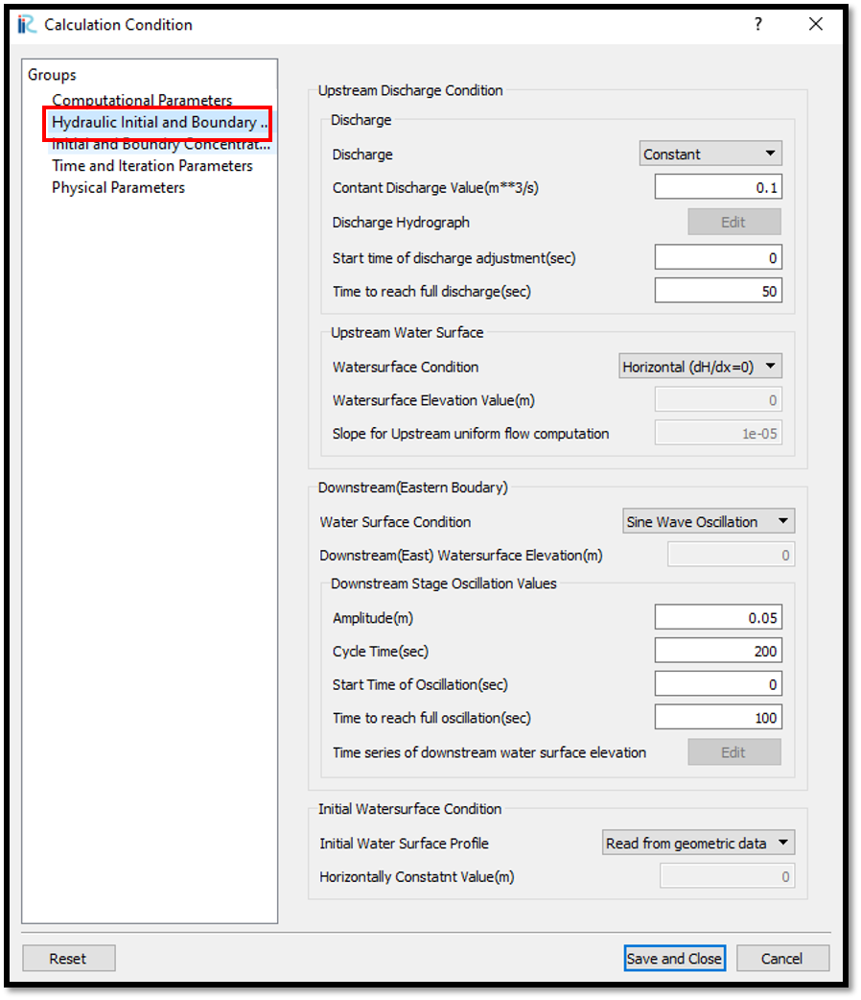
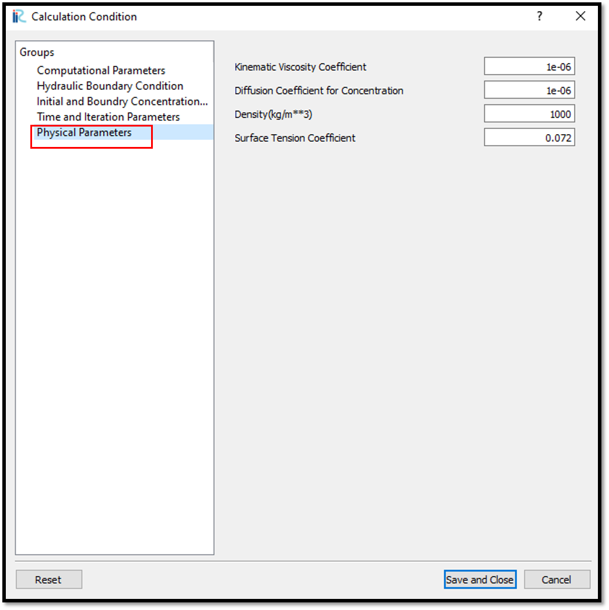
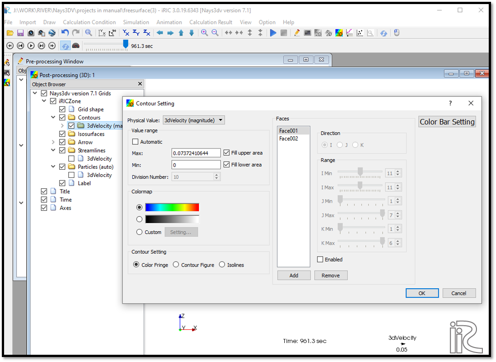
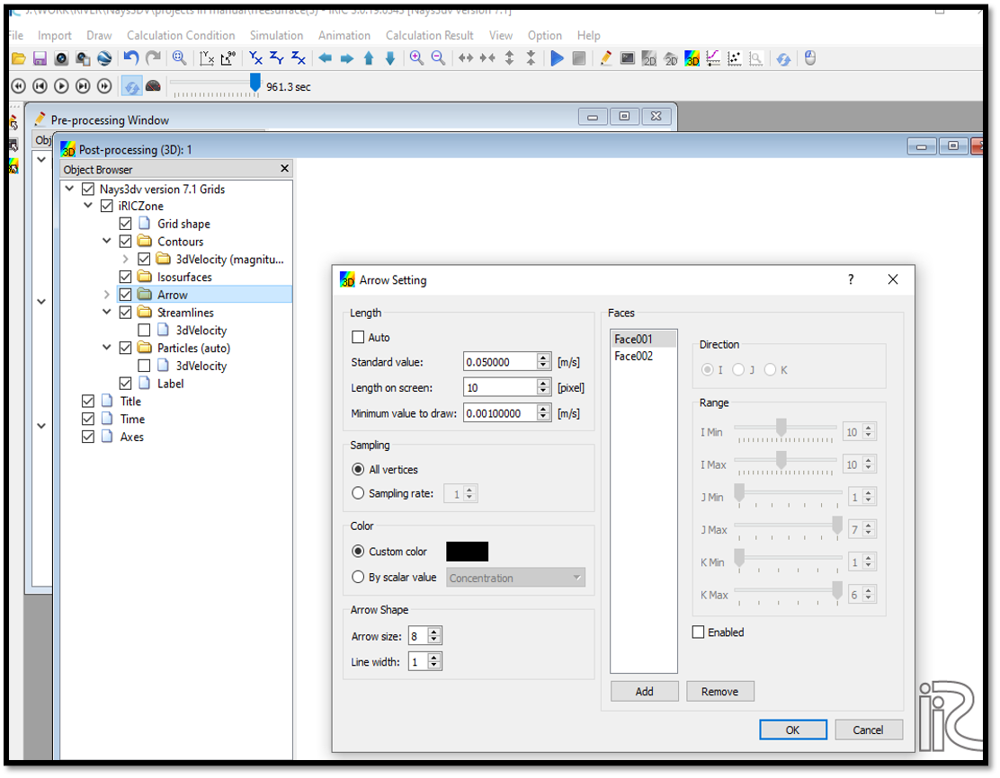

Example 06: Open channel flow
===============================================================

Purpose
-------- 
To calculate the density currents in an open channel.
In this example channel is open both upstream and downstream. Constant dischargeis given from upstream and downstream water surface is oscilating as same as sea water oscilating at a river mouth.

Creation of calculation grid and setting initial conditions
-------------------------------------------------------------     
Create the calculation grid using [Grid] [Select Algorithm to Create Grid] and then select [Gird Generator for Nays3DV] in select grid creating algorithm window. 

In grid creation window, give channel shape parameters as shown in :numref:`image_04_Grid_Creation_01`.

.. _image_06_Grid_Creation_01:

   : Grid creation : Computational Domain

Here the bed is given as a sloped bed with 0.1 slope.

Then we can give channel bed condition. As here we use the default condition flat(no bar) no modifications are needed.

If new grids are added or width is varied it is possible to set them. As in this example no grids added and no width variations, no modifications are needed in them.

Initial water surface profile tab is used to give downstream depth, water surface slope and initial water surface purtavation.  It can be seen as shown in :numref:`image_06_Grid_Creation_02` and click on [Create Grid]. 

.. _image_06_Grid_Creation_02:

   : Grid creation : water surface elevation and Depth

Then the grid is created and a confirmation message box will appear asking to map the geographic data as shown in :numref:`image_06_Grid_Creation_03` and click on [Yes].

.. _image_06_Grid_Creation_03:

   : Grid creation : Mapping geographic data to the grid

This will map the geographic data to the grid and the mapped grid can be seen as shown in :numref:`image_06_Grid_Creation_04`. 

.. _image_06_Grid_Creation_04:

   : Grid creation : Mapping geographic data to the grid

Now save the project with [File] [Save project as  .ipro]. 

Setting the calculation conditions and simulation
---------------------------------------------------
Give the calculation conditions with, 
[Calculation Condition] [Settings] 

Set computational parameters as shown in :numref:`image_06_Calculation_condition_01`.

.. _image_06_Calculation_condition_01:

   : Calculation Condition : Computational Parameters

Then give hydraulic boundary conditions. Since the boundary conditions are Open boundary , boundary condition has to give as shown in :numref:`image_06_Calculation_condition_02`.

.. _image_06_Calculation_condition_02:

   : Calculation Condition : Boundary Conditions

Then give initial and boundary concentrations as shown in :numref:`image_06_Calculation_condition_03`. Since only teh water is simulated and no density flow, initial and boundary concentration window is inactive as shown in the following figure.

.. _image_06_Calculation_condition_03:

   : Calculation Condition : Initial and Boundary Concentrations

Then the time and iteration parameters are given as shown in :numref:`image_06_Calculation_condition_04`. 

.. _image_06_Calculation_condition_04:

   : Calculation Condition : Time and Iteration parameters

Then give the physical parameters as given in :numref:`image_06_Calculation_condition_05`. 

.. _image_06_Calculation_condition_05:

   : Calculation Condition : Physical Parameters

After setting the calculation conditions, save the project by clicking on save tab.
Now start simulation by, [Simulation] [Run]. Simulation will start and after some time it will finish showing the message the solver finished the calculation.

Visualization of results
-------------------------
Open 3D post processing window by selecting, [Calculation Results] [Open new 3D Post-Processing Window].

In this example, Concentration contours and velocity arrows will be plotted. For that, In 3D post processing window, Go to [Object Browser] - [Contours] and right click on conturs and click on [Add]. Then contour setting window will appear as shown in :numref:`image_06_Visualization_of_Results`. 

.. _image_06_Visualization_of_Results:

   : Visualization of Results : Contour Setting

Set the parameters as shown in the above figure such as; physical value to the magnitude of velocity and Add the faces need to plot the velocity magnitude and set their regions.

Then to plot the arrows, go to [Object Browser] - [Arrow] then right click on arrow and then click on [Property]. Arrow setting window will appear as shown in :numref:`image_06_Visualization_of_Results_02`
Then add the faces that arrows need to plot and their i, j, k regions.

.. _image_06_Visualization_of_Results_02:

   : Visualization of Results : Arrow Setting

Now visualize both velocity magnitude plot and arrows on it in selected faces as shown in :numref:`image_06_Visualization_of_Results_03`. 

.. _image_06_Visualization_of_Results_03:

   : Visualization of Results : Velocity contours and arrows

