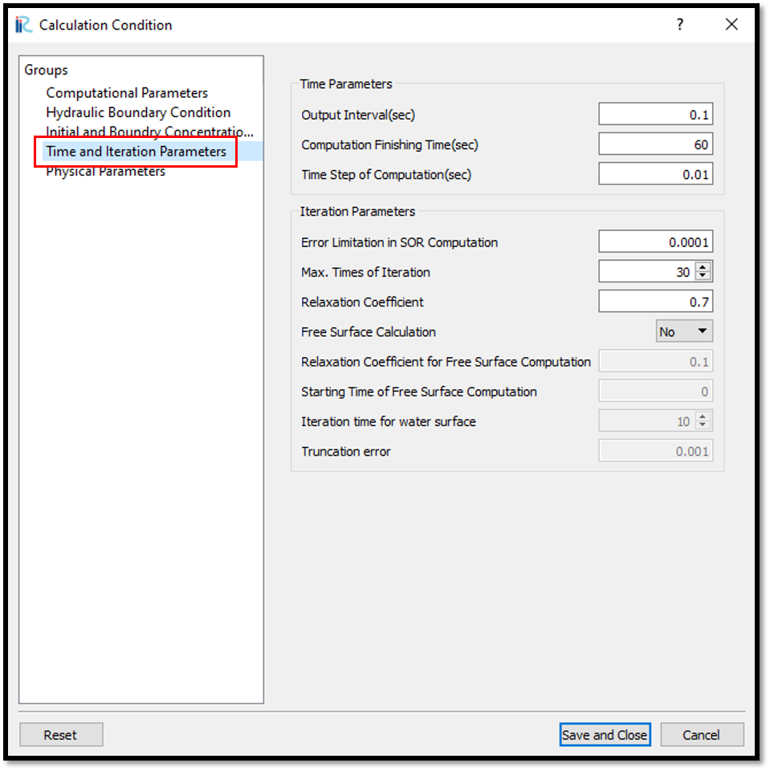
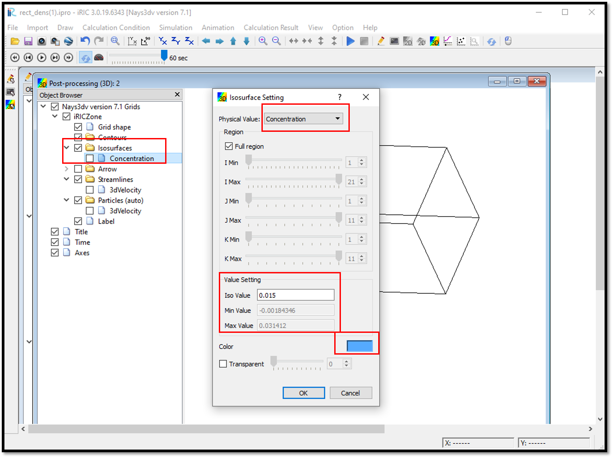
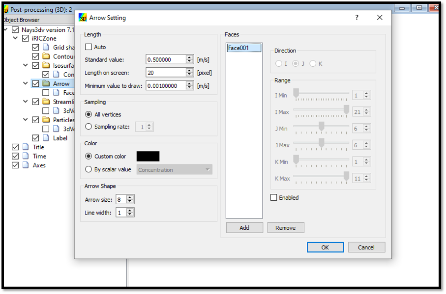

Example 07: Density flow in a rectangular channel
====================================================================

Purpose
-------- 
To calculate the density currents in a rectangular tank.
In this example density currents are simulated in closed tank with flat bottom. Initial concentration is given and additional concentration boundaries are not given. 

Creation of calculation grid and setting initial conditions
-------------------------------------------------------------     
Create the calculation grid using [Grid] [Select Algorithm to Create Grid] and then select [Gird Generator for Nays3DV] in select grid creating algorithm window. 

Then the grid creation window will appear.

In grid creation window, give channel shape parameters as shown in :numref:`image_07_Grid_Creation_01`.

.. _image_07_Grid_Creation_01:

   : Grid creation : Computational Domain

Then we can give channel bed condition. As here we use the default condition flat(no bar) no modifications are needed.

If new grids are added or width is varied it is possible to set them. As in this example no grids added and no width variations, no modifications are needed in them.

Initial water surface profile tab is used to give downstream depth, water surface slope and initial water surface purtavation.  It can be seen as shown in :numref:`image_07_Grid_Creation_02` . After setting all the parameters click on [Create Grid]. Here the bed is given as a sloped bed varying linearly in x direction.

.. _image_07_Grid_Creation_02:

   : Grid creation : Water surface elevation and Depth

Then the grid is created and a confirmation message box will appear asking to map the geographic data as shown in :numref:`image_07_Grid_Creation_03` and click on [Yes].

.. _image_07_Grid_Creation_03:

   : Grid creation : Mapping geographic data to the grid

This will map the geographic data to the grid and the mapped grid can be seen as shown in :numref:`image_07_Grid_Creation_04`. 

.. _image_07_Grid_Creation_04:

   : Grid creation : Mapping geographic data to the grid

Now save the project with [File] [Save project as  .ipro]. 

Setting the calculation conditions and simulation
---------------------------------------------------
Set the calculation conditions with [Calculation Condition], [Setting].

Calculation condition window will open.

Set computational parameters as shown in :numref:`image_07_Calculation_condition_01`.

.. _image_07_Calculation_condition_01:

   : Calculation Condition : Computational Parameters

Then give hydraulic boundary conditions. Since the boundary conditions are closed boundaries , boundary condition window is inactive as shown in :numref:`image_07_Calculation_condition_02`.

.. _image_07_Calculation_condition_02:

   : Calculation Condition : Boundary Conditions

Then give initial and Boundary concentrations as shown in :numref:`image_07_Calculation_condition_03`. 

.. _image_07_Calculation_condition_03:

   : Calculation Condition : Initial and Boundary Concentrations

Here initial density distribution is given in calculation conditions. For that the i, j, k start and end locations of the purturbed concentration should be given as shown in above figure.
 
Then the time and iteration parameters are give as shown in :numref:`image_07_Calculation_condition_04`. 

.. _image_07_Calculation_condition_04:

   : Calculation Condition : Time and Iteration parameters

Then give the physical parameters as given in :numref:`image_07_Calculation_condition_05`. 

.. _image_07_Calculation_condition_05:

   : Calculation Condition : Physical Parameters

After setting the calculation conditions, save the project by clicking on save tab.
Now start simulation by, [Simulation] [Run]. Simulation will start and after some time it will finish showing the message the solver finished the calculation.

Visualization of results
-------------------------
Open 3D post processing window by selecting, [Calculation Results] [Open new 3D Post-Processing Window].

In this example, isosurface concentration with arrows are plotted. For that, go to [Object Browser] - [Isosurfaces] and right click on isosurfaces. Then click on [Add]. Isosurface setting window will appear as shown in :numref:`image_07_Results_visualization_01`. 

.. _image_07_Results_visualization_01:

   : Results Visualization : Isosurface setting 

In the isosurface setting window, give physical value as concentration, and value setting as 0.015. Value setting can be done using the min and max value as a guide and can set to a value in between.
Then the color has to be set and if no color is set, the isosruface cannot be seen as the default color is white. 

created isosurface can be seen as shown in :numref:`image_07_Results_visualization_02`. 

.. _image_07_Results_visualization_02:

   : Results Visualization : Isosurface of Concentration 

To add arrow to the plot, go to [Object Browser] - [Arrow] and right click on arrow. Then click on [Property]. Arrow setting window will appear as shown in :numref:`image_07_Results_visualization_03`. 

.. _image_07_Results_visualization_03:

   : Results Visualization : Arrow Setting

Here add a face and select direction and region where arrow need to plotted.
and the length of the arrow can be adjusted as shown in the above fig. This can be changed according to the visualization requirement.

The final figure with the isosurface of concentration and arrows for the currents can be seen as shown in :numref:`image_07_Results_visualization_04`. 

.. _image_07_Results_visualization_04:

   : Results Visualization : Isosurface of concentration with currents

