Example 08: Rectangular channel with an osbtacle
=========================================================================

Purpose
-------- 
To calculate the density currents in a rectangular channel with an obstacle.
In this example density currents are simulated in a closed rectangular channel with a sloped bottom with obstacles.

Creation of calculation grid and setting initial conditions
-------------------------------------------------------------     
Create the calculation grid using [Grid] [Select Algorithm to Create Grid] and then select [Gird Generator for Nays3DV] in select grid creating algorithm window. 
Then the grid creation window will appear.

In grid creation window, give channel shape parameters as shown in :numref:`image_08_Grid_Creation_01`. Here the bed is given as a sloped bed varying linearly in x direction.

.. _image_08_Grid_Creation_01:

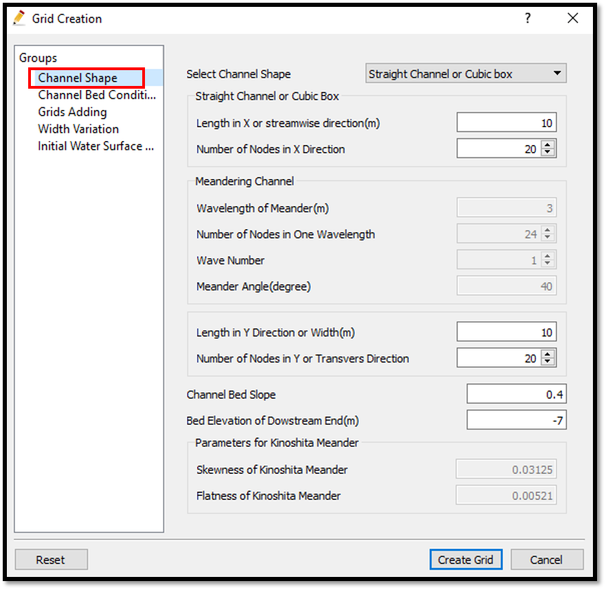

   : Grid creation : Computational Domain

Then we can give channel bed condition. As here we use the default condition flat(no bar), no modifications are needed.

If new grids are added or width is varied it is possible to set them. As in this example no grids added and no width variations, no modifications are needed in them.

Initial water surface profile tab is used to give downstream depth, water surface slope and initial water surface purtavation.  It can be seen as shown in :numref:`image_08_Grid_Creation_02`. After setting all the parameters, click on [Create Grid]. 

.. _image_08_Grid_Creation_02:

   : Grid creation : Water surface elevation and Depth

Then the grid is created and a confirmation message box will appear asking to map the geographic data as shown in :numref:`image_08_Grid_Creation_03` and click on [Yes].

.. _image_08_Grid_Creation_03:

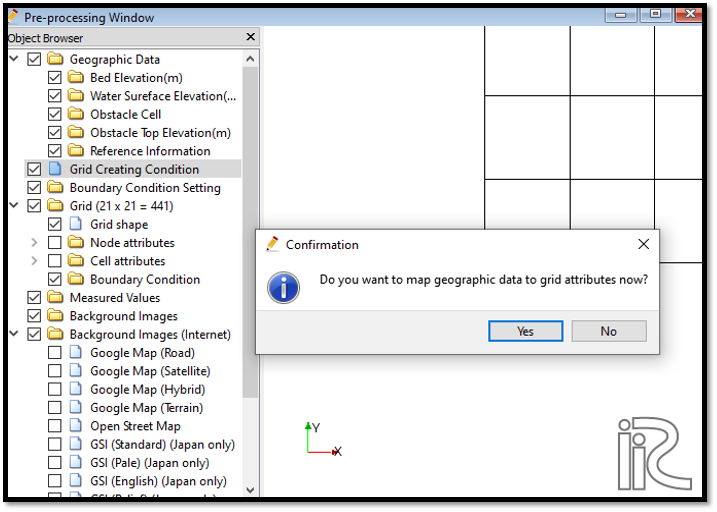

   : Grid creation : Mapping geographic data to the grid

This will map the geographic data to the grid and the mapped grid can be seen by selecting in object browser [Grid] - [Node attributes] - [Elevation] .

Now a obstacle cell needs to be added to the grid. For that, go to [Object Browser] - [Geographic Data] - [Obstacle cell]. Now right click on obstacle cell and click on [Add polygon group]. Now it is possible to draw the obstacle polygon and after drawing the polygon, edit osbtacle box will apear to edit the polygon. There it is possible to set the obstacle cell or normal cell as shown in :numref:`image_08_Grid_Creation_04`. 

.. _image_08_Grid_Creation_04:

   : Grid creation : Adding an Obstacle

Now the top elevation of the obstacle has to be given. For that, go to [Object Browser] - [Geographic Data] - [Obstacle Top Elevation]. Now right click on obstacle top elevation and click on [Add polygon group]. Now it is possible to draw the obstacle top elevation polygon and after drawing the polygon, edit osbtacle top elevation value box will apear to edit the polygon. There it is possible to set the obstacle top elevation value as shown in :numref:`image_08_Grid_Creation_05`.

.. _image_08_Grid_Creation_05:

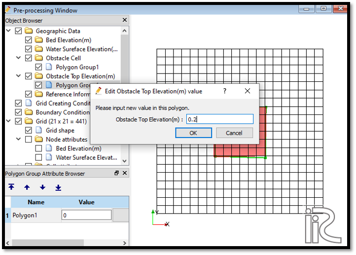

   : Grid creation : Obstacle top elevation 

Here to have an effect from the obstacle, the obstacle top elevation is set as higher than the water surface.

Now the obstacle cell and obstacle top elevation need to be mapped to the grid. 
For that, go to [Grid] - [Attributes mapping] - [Execute]. Then the attribute mapping window will appear. Select Obstacle cell and Obstacle Top elevation as shown in :numref:`image_08_Attributes_mapping_01`.

.. _image_08_Attributes_mapping_01:

   :Attributes mapping 

Confirmation window will appear saying that attributes mapped properly.

It is possible to see the mapped attributes by ticking on cell attributes.
[Object Browser] - [Grid] - [Cell Attributes] as shown in :numref:`image_08_Attributes_mapping_02`.

.. _image_08_Attributes_mapping_02:

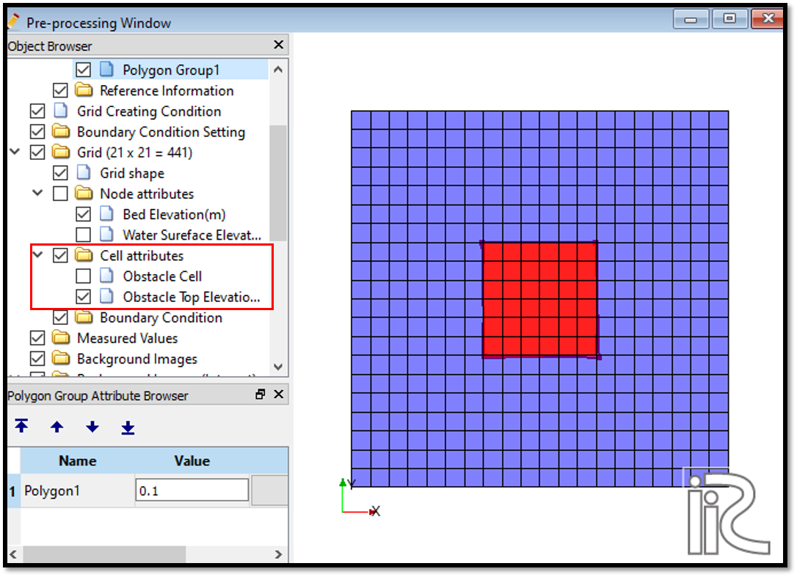

   :Attributes mapping check

Now save the project with [File] [Save project as  .ipro]. 

Setting the calculation conditions and simulation
---------------------------------------------------
Set the calculation conditions with [Calculation Condition], [Setting].

Calculation condition window will open.

Set computational parameters as shown in :numref:`image_08_Calculation_condition_01`.

.. _image_08_Calculation_condition_01:

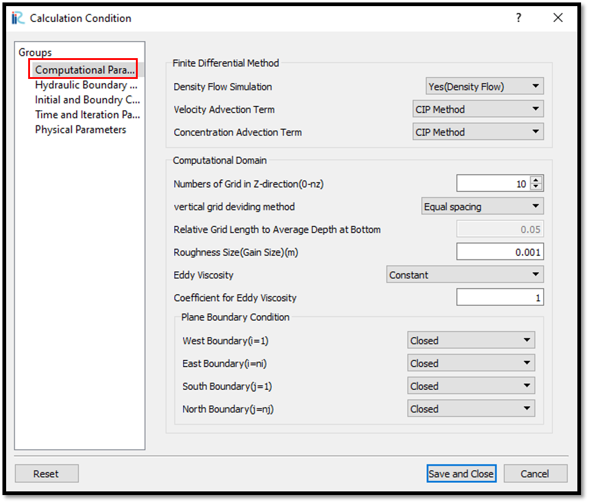

   : Calculation Condition : Computational Parameters

Then give hydraulic boundary conditions. Since the boundary conditions are closed boundaries , mostparts of the boundary condition window is inactive as shown in :numref:`image_08_Calculation_condition_02`.

.. _image_08_Calculation_condition_02:

   : Calculation Condition : Boundary Conditions

Then give initial and boundary concentrations as shown in :numref:`image_08_Calculation_condition_03`. 

.. _image_08_Calculation_condition_03:

   : Calculation Condition : Initial and Boundary Concentrations

Here initial density distribution is given in calculation conditions. For that the i, j, k start and end locations of the purturbed concentration should be given as shown in above figure.
 
Then the time and iteration parameters are give as shown in :numref:`image_08_Calculation_condition_04`. 

.. _image_08_Calculation_condition_04:

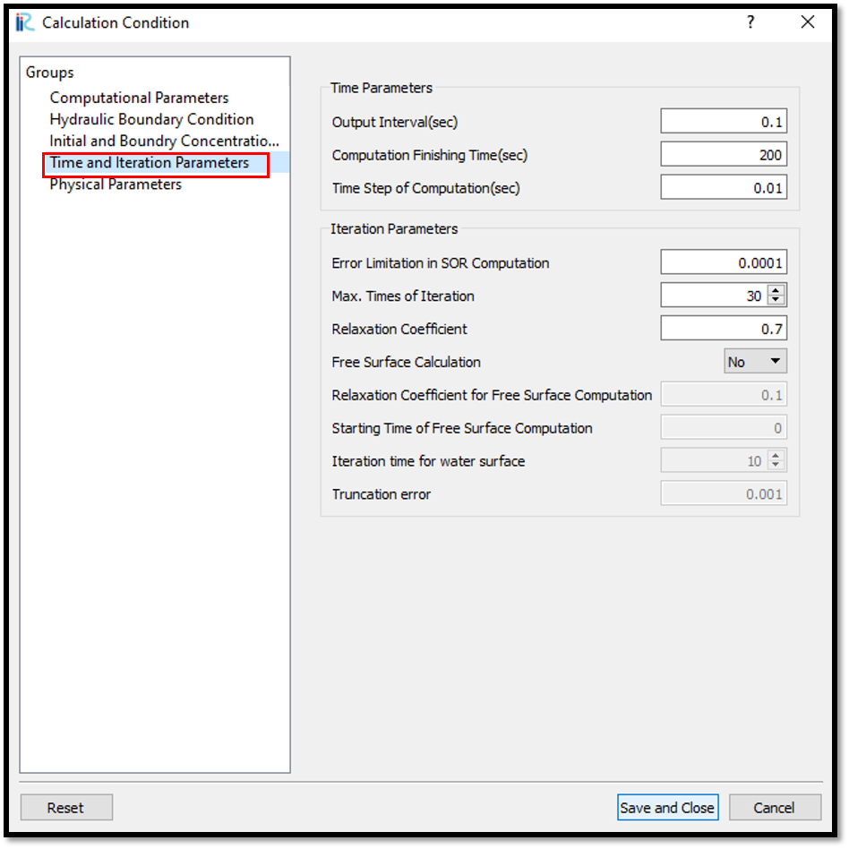

   : Calculation Condition : Time and Iteration parameters

Then give the physical parameters as given in :numref:`image_08_Calculation_condition_05`. 

.. _image_08_Calculation_condition_05:

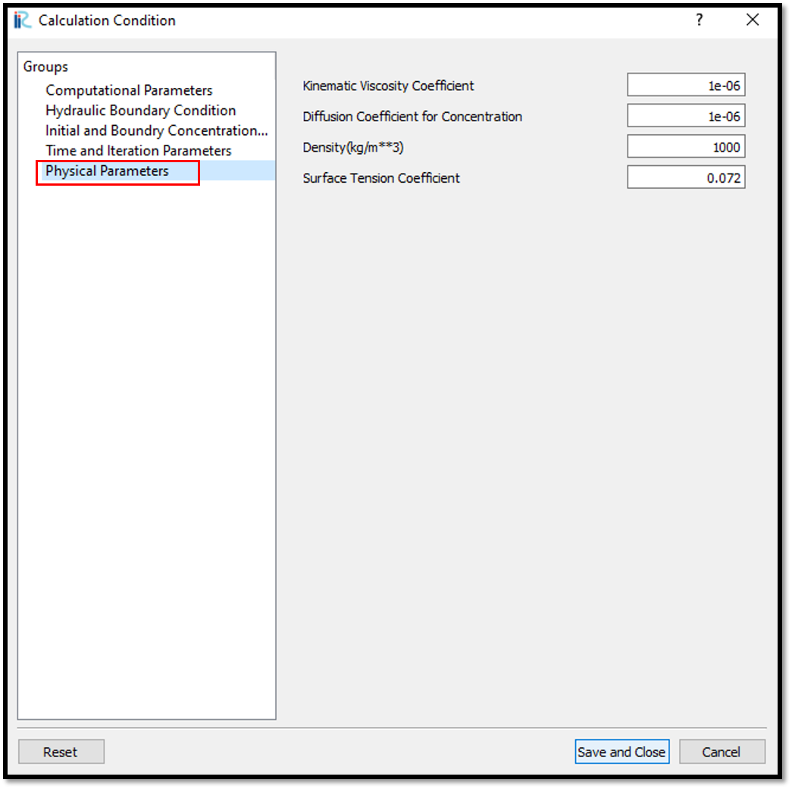

   : Calculation Condition : Physical Parameters

After setting the calculation conditions, save the project by clicking on save tab.
Now start simulation by, [Simulation] [Run]. Simulation will start and after some time it will finish showing the message the solver finished the calculation.

Visualization of results
-------------------------
Open 3D post processing window by selecting, [Calculation Results] [Open new 3D Post-Processing Window].

In this exmaple, Isosurfaces of concentration, 3D obstacle and arrows(3D velocity) will be plotted. For that, go to [Object Browser] - [Iso surfaces] and [Add]. Isosurface setting window will appear as shown in :numref:`image_08_Visualization_of_Results_01`. 

.. _image_08_Visualization_of_Results_01:

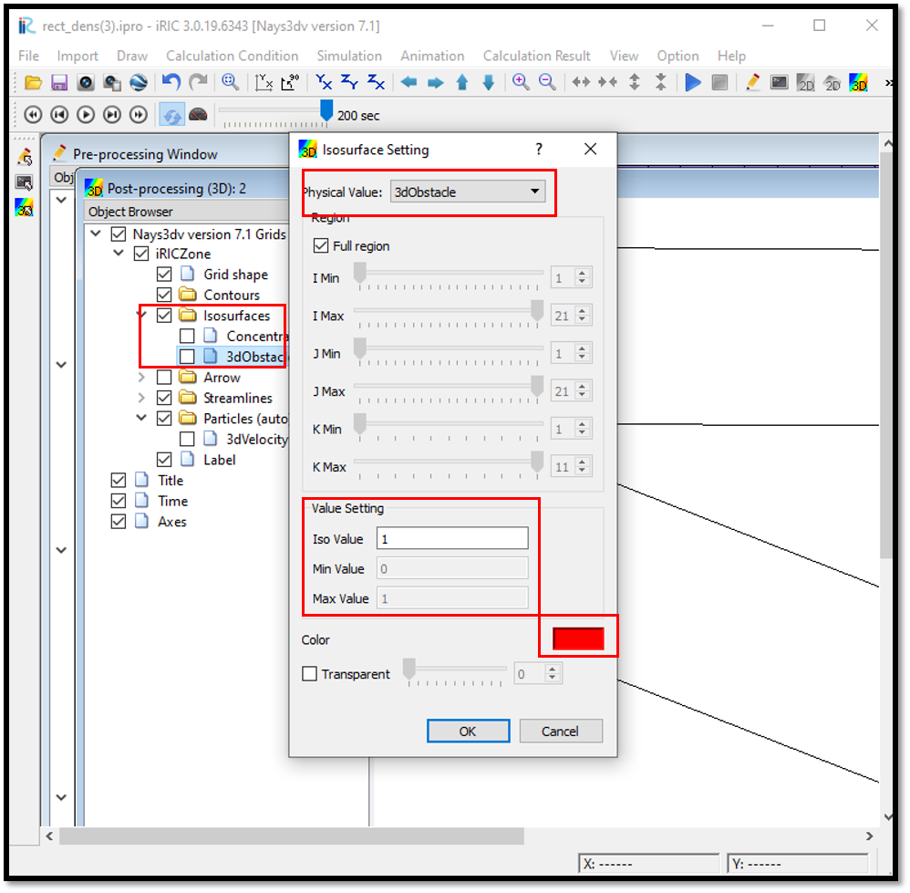

   : Visualization of Results : 3dObstacle Isosurface setting

Here set physical value as 3dObstacle and in value setting set value to 1. For the colour set a colour as shown in the above fig. If no colour is selected as the default colour is white,  Obstacle may not be visible.
 
As the same way, set isosurface for concentration as shown in  :numref:`image_08_Visualization_of_Results_02`. 

.. _image_08_Visualization_of_Results_02:

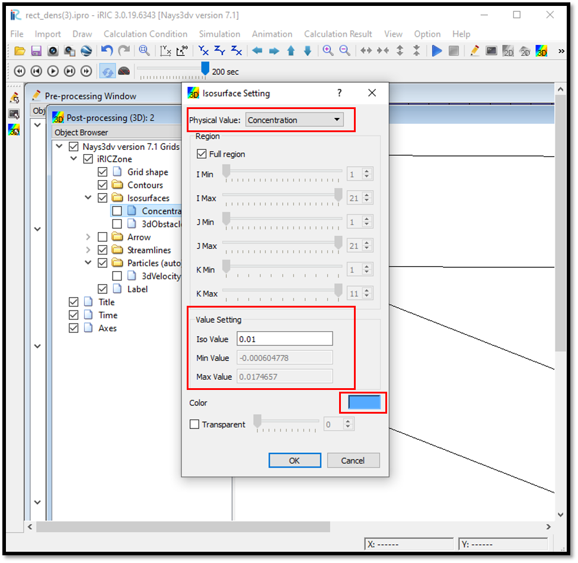

   : Visualization of Results : Concentration Isosurface setting

Then set the arrows for 3Dvelocity. For that, go to [Object Browser] - [Arrows] and right click on arrows. Click on [Property]. Then arrow setting window will appear as shown in  :numref:`image_08_Visualization_of_Results_03`. 

.. _image_08_Visualization_of_Results_03:

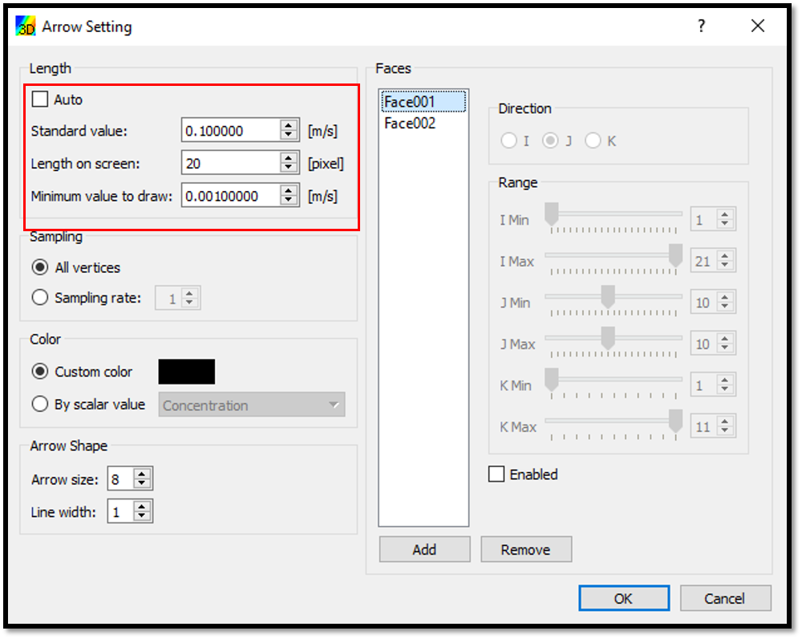

   : Visualization of Results : Arrow setting

Here add the faces where the arrows need to be plot and their direction and range. Then adjust the arrow length.

The combined plot will be as shown in :numref:`image_08_Visualization_of_Results_04`. 

.. _image_08_Visualization_of_Results_04:

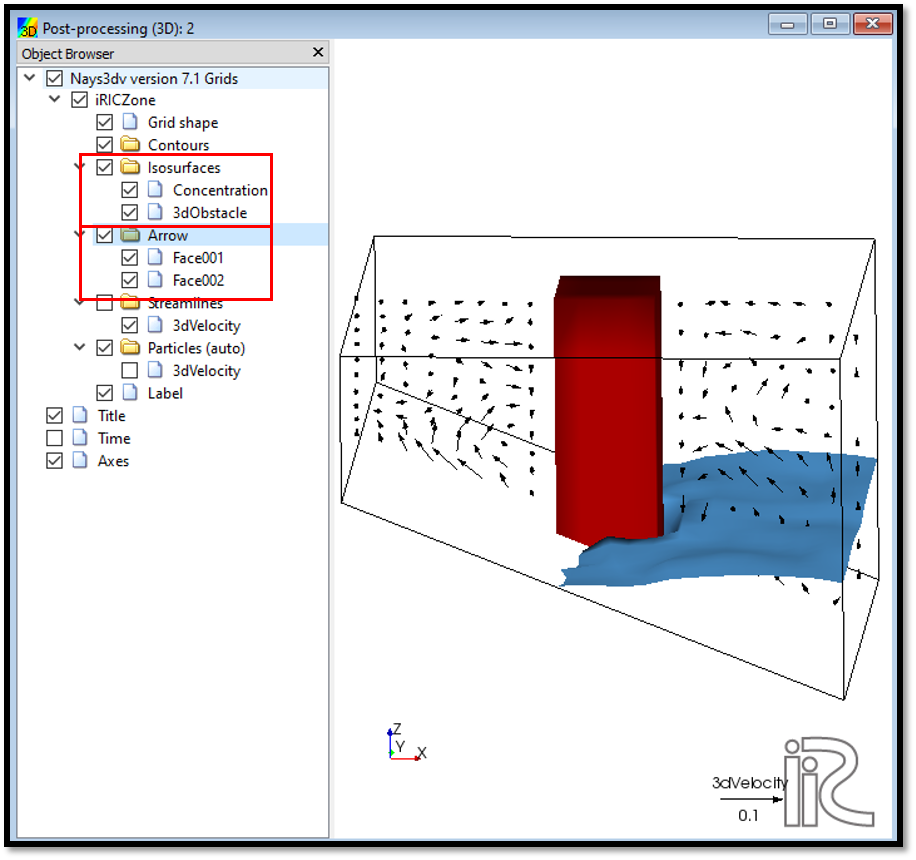

   : Visualization of Results : 3d velocity currents and concentration with the obstacle

